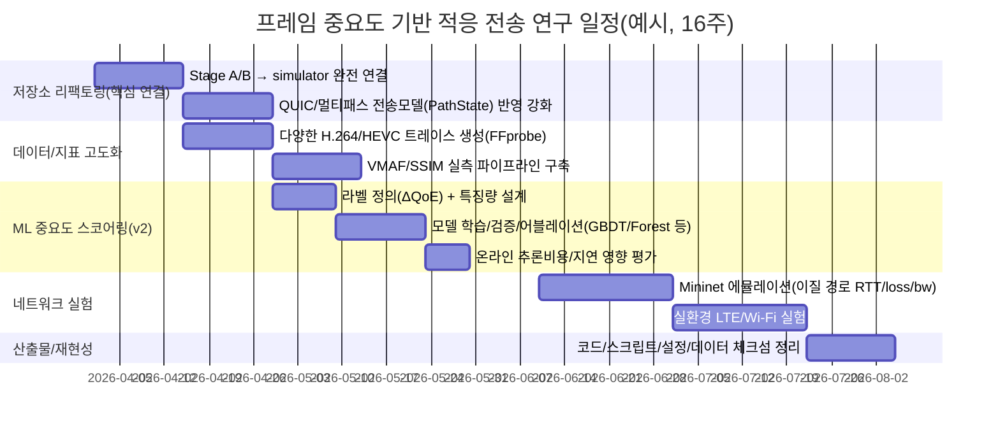

# 프레임 단위 콘텐츠 중요도 기반 적응형 비디오 전송 연구방향 심화 리서치 보고서

## 실행 요약

활성 커넥터는 **GitHub(1개)**이며, 본 보고서는 먼저 GitHub 저장소 `knougitrepos/network`를 근거로 현 상태를 정리한 뒤, QUIC/MPQUIC/MPTCP, FFmpeg/VMAF, Mininet, 코덱(H.264/HEVC)과 관련된 1차(표준/RFC/공식) 자료를 추가 조사하여 연구방향을 설계한다. fileciteturn21file0L1-L1 citeturn0search2turn1search2turn1search5turn0search3turn0search0turn2search0turn4search1

핵심 결론은 다음과 같다.  
첫째, 저장소는 “TCP batching”이 아니라 **H.264 IPB 프레임 중요도 기반 프레임 단위 전송 행동 결정(heuristic → ML → RL 고도화)**을 명시적으로 목표로 하며, 이미 Stage A(중요도 스코어링)와 Stage B(전송 행동 매핑) 구조·지표·워크로드를 갖춘 상태다. fileciteturn21file0L1-L1 fileciteturn32file0L1-L1  
둘째, 지금의 가장 큰 연구공백은 **(A) ML 기반 중요도 모델을 실제로 학습/평가하는 파이프라인**, **(B) QUIC Stream/DATAGRAM 및 멀티패스 스케줄링을 시뮬레이터/에뮬레이터/실환경으로 일관되게 연결**하는 구현·실험 설계다. fileciteturn25file0L1-L1 fileciteturn26file0L1-L1 citeturn1search2turn1search5  
셋째, 표준 관점에서 “부분 신뢰성(partial reliability)”은 **QUIC DATAGRAM(RFC 9221)**이 가장 정합적이며, “멀티패스”는 **IETF Multipath QUIC Internet-Draft**가 메커니즘을 제공하지만 **스케줄링(어떤 데이터를 어떤 경로로 보낼지)**은 의도적으로 규정하지 않아 연구 기여 지점이 명확하다. citeturn1search2turn1search0turn1search5  
넷째, 비교 베이스라인으로는 (i) 논문 레벨의 **MPR-QUIC**, (ii) 구현/아티팩트 레벨의 **MPQUIC 프로토타입들**, (iii) 성숙한 멀티패스 신뢰 전송의 기준선인 **Linux MPTCP**를 동시에 두는 구성이 설득력이 높다. citeturn3search0turn5search2turn5search9turn0search3turn0search12

## GitHub 저장소 분석

### 저장소 목표와 현재 구조

`README.md`는 연구의 정체성을 “프레임 중요도 기반 적응 전송(휴리스틱→ML→RL)”으로 선언하고, “TCP batching 연구가 아님”을 명시한다. 또한 QUIC Stream/DATAGRAM 및 멀티패스 전송 모델 추상화, QoE 지표 확장, RL 환경 프레임워크가 이미 포함되어 있음을 적는다. fileciteturn21file0L1-L1

현재 저장소는 대략 다음 레이어로 구성된다. (디렉터리/파일 명칭은 `README.md`의 구조 정의를 따름) fileciteturn21file0L1-L1

- **core/**: workload 생성, 전송 모델(TCP/QUIC), 시뮬레이터  
- **policy/**: Stage A(importance scorer), Stage B(action mapping), legacy 정책  
- **eval/**: 지표 계산 및 objective score 산정  
- **rl/**: FrameSchedulingEnv (Gymnasium-style)  
- **scripts/**: `ffprobe` 기반 H.264 frame trace 추출  
- **data/**: frame trace CSV

### 실제로 확인한 파일과 핵심 발견

아래는 본 리서치에서 **직접 열람한 파일 목록**과, 연구방향 설정에 직접 영향을 주는 “핵심 발견”이다.

| 열람 파일 | 핵심 내용 | 연구방향에 주는 의미 |
|---|---|---|
| `README.md` fileciteturn21file0L1-L1 | 프레임 중요도 기반 적응 전송, Stage A/B 분리, QUIC 모델, QoE 지표 확장, “TCP batching 아님” 명시 | 연구 정체성(문제정의/기여점/범위)이 이미 정리돼 있어, “ML·실험 재현성”을 중심으로 확장하면 됨 |
| `docs/initial_plan.md` fileciteturn32file0L1-L1 | 범위/제외 항목, Stage A(v1 heuristic, v2 ML, v3 RL), Stage B(FrameAction), 지표/Objective weights 정의 | 논문형 연구계획(고정 문서)이 존재 → 이후 변경은 changelog로 관리하는 재현성 전략 가능 |
| `policy/importance.py` fileciteturn25file0L1-L1 | HeuristicImportanceScorer: IPB 타입 + deadline slack + keyframe bonus를 0~1 score로 출력 | ML scorer는 이 인터페이스(ImportanceScorer)를 그대로 교체하면 됨 |
| `policy/action.py` fileciteturn26file0L1-L1 | FrameAction 5종(신뢰 단일/신뢰 멀티/비신뢰/중복/드롭) + rule 기반 select_action | “중요도 점수 → 전송 행동” 연결점이 명확. ML은 점수 예측에 집중하고, 행동 매핑은 별도 실험 축으로 둬도 됨 |
| `core/workload.py` fileciteturn24file0L1-L1 | video trace CSV를 로드하고 `display_deadline_ms = pts + duration + playback_buffer` 로 deadline 생성 | deadline-aware 전송 연구의 실험 정의(“on-time” 판정)가 코드로 고정됨 |
| `scripts/extract_video_trace.py` fileciteturn29file0L1-L1 | `ffprobe -show_frames`로 pict_type(I/P/B), pkt_size 등을 추출하여 trace CSV 생성 | 데이터 생성 파이프라인이 이미 있음. 다양한 콘텐츠/코덱(H.264/HEVC)로 확장 가능 ([ffmpeg.org](https://www.ffmpeg.org/ffprobe-all.html?utm_source=chatgpt.com)) |
| `eval/metrics.py` fileciteturn28file0L1-L1 | late/keyframe late/decodable GOP/useful goodput + rebuffer_ratio + ssim_proxy + block_completion_ratio | “BufRatio, aSSIM” 요구를 현재는 proxy로 대체. 향후 SSIM/VMAF 실측으로 업그레이드 필요 |
| `core/transport.py` fileciteturn23file0L1-L1 | TCPTransportModel + QUICTransportModel(프로토타입, path loss 반영) | QUIC/DATAGRAM 및 multipath 실험을 “모델 레벨”에서 먼저 검증 가능 |
| `core/simulator.py` fileciteturn22file0L1-L1 | 아직 “legacy batch/flush 정책” 중심으로 run_simulation 구성, 다만 video QoE 기록·goodput 계산 포함 | Stage A/B의 “프레임 단위 행동”을 simulator에 완전 연결하는 리팩토링이 다음 우선순위 |
| `rl/env.py` fileciteturn30file0L1-L1 | RL 환경은 존재하나, 현재는 TCPTransportModel 기반이며 action이 실제 전송모드/경로에 충분히 반영되지는 않음 | RL은 ‘마지막 단계(v3)’로 두되, 먼저 시뮬레이터에서 action 효과가 물리적으로 반영되도록 해야 함 |

## 연구 목표 대비 갭과 목표 아키텍처

### 갭 정리

저장소는 연구 “방향성”은 매우 잘 잡혀 있으나, 논문/보고서 수준에서 설득력을 높이려면 아래 갭을 메워야 한다.

1) **Stage A(중요도) ML 파이프라인의 부재**  
현재 v1은 HeuristicImportanceScorer로 구현되어 있으며(타입/슬랙/키프레임 보너스), v2 ML은 계획만 존재한다. fileciteturn25file0L1-L1 fileciteturn32file0L1-L1  
→ 필요: “라벨 정의”, “특징량”, “학습/검증 분할”, “과적합/이식성 평가”, “추론비용(온라인 가능성)”을 포함한 실험 설계.

2) **Stage B(행동)과 QUIC 부분 신뢰성의 실제 구현 연결**  
FrameAction은 QUIC Stream/DATAGRAM을 개념적으로 표현하나, QUIC DATAGRAM은 RFC 9221에서 “프레임은 재전송을 요구하지 않는 unreliable datagram”으로 정의되며, application이 datagram을 multiplex하고 의미를 부여해야 한다. fileciteturn26file0L1-L1 citeturn1search2turn5search5  
→ 필요: “중요 프레임=Stream(신뢰), 덜 중요=DATAGRAM(비신뢰/만료)” 정책을 실제 QUIC 스택(aioquic 등)과 연결.

3) **멀티패스 스케줄링(연구 기여 지점) 정식화 부족**  
IETF multipath QUIC draft는 여러 path를 관리하는 메커니즘을 제공하지만, “어떤 데이터를 어떤 경로로 보내는지(스케줄링)”은 명시하지 않는다. citeturn1search0turn1search5  
→ 필요: “프레임 중요도/마감시간/경로상태(RTT·loss·bw)”를 입력으로 한 스케줄링 규칙/최적화/학습을 명시하고, 그 효과를 지표로 입증.

### 목표 아키텍처 제안 (논문형 서술에 최적)

저장소의 설계를 그대로 활용하되, 논문에서 “기여점”을 명확히 드러내기 위해 다음 2+1 구조로 정식화하는 것을 권한다.

- **Stage A: ImportanceScorer(기여의 핵심)**  
  - 입력: IPB 타입, deadline slack, GOP 위치, payload 크기, (확장) 시간적/공간적 복잡도 특징량, buffer 상태, 경로 상태  
  - 출력: importance score(0~1), 또는 중요도 등급 + 불확실성(선택)

- **Stage B: Action Mapper(시스템 기여)**  
  - 입력: score, slack, 네트워크 상태, 경로 수  
  - 출력: FrameAction(신뢰 단일/신뢰 멀티/비신뢰/중복/드롭) fileciteturn26file0L1-L1  
  - QUIC 관점 대응: Stream ↔ 신뢰, DATAGRAM ↔ 비신뢰/만료 가능. citeturn1search2turn5search5

- **Stage C: Scheduler/Transport Binding(멀티패스 + 실제 실험 연결)**  
  - MPQUIC/멀티패스에서 path 선택, 중복 전송 시 path 분산, 만료 프레임 drop  
  - “스케줄링이 표준에 의해 열려 있음”이 곧 연구 기여 가능성. citeturn1search5turn3search12

## 실험을 위한 도구·데이터·코덱·평가 지표 설계

### 필요한 소프트웨어/하드웨어/도구

저장소 자체가 Python 의존성을 `requirements.txt`로 고정하고 있다. fileciteturn31file0L1-L1  
추가로, 프레임 trace 추출/품질지표 계산을 위해 다음이 필요하다.

- **FFmpeg/ffprobe**: frame별 메타데이터 추출(`-show_frames`). fileciteturn29file0L1-L1 citeturn2search12  
- **VMAF**: `libvmaf` 기반 품질평가 및 모델 학습 도구(오픈소스). citeturn2search0  
- **Mininet**: 재현 가능한 네트워크 에뮬레이션 환경(단일 머신에서 현실적인 네트워크 구성). citeturn0search0  
- **멀티홈 실환경 장비**: Wi‑Fi + LTE/5G(예: 테더링/동글)로 2경로를 확보. MPTCP의 기본 동기(여러 인터페이스 동시 사용, 대역폭 집계/복원력)와 같은 실험 설정이 필요. citeturn0search3turn0search12  

### 데이터셋 및 코덱 선택

코덱·콘텐츠 다양성은 “IPB만으로 중요도가 충분한가?”를 검증하는 데 직접 영향을 준다. HEVC는 표준적으로 더 높은 압축 효율을 목표로 한다. citeturn4search1

| 옵션 | 장점 | 단점/주의 | 추천 사용 단계 |
|---|---|---|---|
| 저장소 기반 trace(예: BBB 10초) | 파이프라인 즉시 검증 가능, 반복실험 쉬움 | 콘텐츠 다양성 부족 | 초기(회귀테스트/성능회귀 방지) |
| UVG(4K 50/120fps) | 공개 연구용 4K 시퀀스, 코덱 분석 목적에 최적화 | 용량/연산비용 큼, BY‑NC 라이선스 고려 | 중기~후기(논문 핵심 결과) citeturn2search14 |
| 사용자 생성 콘텐츠(다양한 motion/scene) | ML 일반화 검증에 유리 | 저작권/배포 제약 | 부록/내부 검증 |

H.264 기반 프레임/전송 의존성을 설명할 때는 H.264가 ITU-T/ISO 표준이며 RTP payload 문서에서도 그 구조 및 NAL 개념을 정리한다는 점을 1차 근거로 둘 수 있다. citeturn4search0  

### ML 모델, 라벨, 특징량(Features) 설계

저장소의 Stage A 인터페이스는 ML 기반 scorer로 “교체”하기 쉽게 설계돼 있다. fileciteturn25file0L1-L1  
문제는 “중요도” 라벨을 어떻게 정의하느냐이며, 가장 방어적인 정의는 **‘프레임을 늦게/드롭했을 때 QoE 손실의 기여도(ΔQoE)’**로 두는 것이다. 이는 MPR-QUIC이 “deadline을 맞추지 못하는 데이터는 폐기/우선순위 조정”을 핵심 동기로 삼는 것과 논리적으로 연결된다. citeturn3search0  

| 항목 | 권장안 | 구현 포인트 |
|---|---|---|
| 라벨(지도학습) | ΔQoE 기반: 특정 프레임을 drop/late 처리했을 때 rebuffer/품질(SSIM/VMAF) 변화량 | 초기엔 `ssim_proxy`로 라벨 근사 후, 후기에 VMAF/SSIM 실측으로 교체 fileciteturn28file0L1-L1 citeturn2search0turn0search13 |
| 특징량(최소) | frame_type(I/P/B), key_frame, payload_bytes, slack_ms, GOP 위치 | 이미 trace와 workload에 존재 fileciteturn24file0L1-L1 |
| 특징량(확장) | motion/scene-change proxy, 최근 late 비율, path별 RTT/loss/bw | MPQUIC 시뮬·실측에서 수집, 모델 이식성 검증 citeturn1search5 |
| 모델 후보 | GBDT/RandomForest, 경량 MLP, (선택) sequence 모델 | 온라인 추론 비용과 일관성(재현성) 우선 |

### 평가 지표 체계

저장소는 이미 video QoE 지표를 정의하고 objective score 가중치까지 고정 문서로 명시한다. fileciteturn32file0L1-L1 fileciteturn34file0L1-L1  
요구된 지표(BufRatio, aSSIM 등)를 다음처럼 정렬하면 논문 설득력이 좋다.

| 지표 | 의미 | 저장소/문헌 대응 | 구현/측정 방법 |
|---|---|---|---|
| BufRatio | 버퍼링(재생중단) 비율 | 저장소 `rebuffer_ratio`는 연속 late 구간 비율로 근사 fileciteturn28file0L1-L1 | 후기에 “재생시간 대비 stall time”으로 정식화(플레이어/에뮬 기반) |
| aSSIM | stall/late를 반영한 평균 SSIM 변형 | SSIM은 표준적 IQA 지표 citeturn0search13 | (1) 프레임별 SSIM 계산 후 stall 구간은 0 처리(정의 명시) |
| block completion ratio | deadline 내 “단위 블록” 완수율 | 저장소는 GOP 단위로 `block_completion_ratio` 정의 fileciteturn28file0L1-L1; MPR-QUIC은 data block completion을 강조 citeturn3search0 | block 정의를 “GOP/segment/frame 묶음” 중 하나로 고정 후 비교 |
| goodput | 유효 전달량 | 저장소는 `goodput_bytes`/`useful_goodput_bytes` 개념을 둠 fileciteturn22file0L1-L1 fileciteturn28file0L1-L1 | (deadline 내 도착분만 goodput로 집계하는 보조 지표 권장) |
| latency | 지연(평균, p95) | 저장소 `latency_mean_ms`, `latency_p95_ms` fileciteturn22file0L1-L1 | Mininet/실환경에서 동일 정의 유지 |

## QUIC/MPQUIC/TCP 통합 전략과 베이스라인

### QUIC에서 “부분 신뢰성” 구현의 정합성

QUIC v1은 secure transport 및 stream 기반 통신을 제공한다. citeturn0search2  
RFC 9221은 QUIC에 **unreliable DATAGRAM**을 도입하며, DATAGRAM frame의 동작(재전송 없음, 프래그먼트 불가, 혼잡제어 적용, 애플리케이션 multiplex 책임)을 명시한다. citeturn1search2turn5search5  

따라서 “중요 프레임은 신뢰(stream), 덜 중요한 프레임은 비신뢰(datagram) 또는 만료(drop)”라는 설계는 표준과 잘 맞는다. 이는 MPR-QUIC의 핵심 아이디어(신뢰/비신뢰 결합의 효율)와도 합치한다. citeturn3search0  

### MPQUIC(멀티패스 QUIC)에서의 연구 기여점

Multipath QUIC Internet-Draft는 단일 연결에서 여러 path를 동시 사용하도록 확장하며, path ID 등 메커니즘을 정의한다. citeturn1search0turn1search5  
그러나 “언제 어떤 path를 열고, 어떤 데이터를 어느 path로 보낼지” 스케줄링은 표준의 범위 밖이다. 이 공백이 곧 “프레임 중요도 기반 멀티패스 스케줄러”라는 연구 기여로 이어진다. citeturn1search5turn3search12  

실험 재현을 위해, MPQUIC 프로젝트는 프로토타입과 아티팩트/코드 계통을 공개해 왔고, MP-QUIC(Go 기반) 저장소도 존재한다. citeturn5search2turn5search9turn5search14  

### MPTCP(TCP 기반 멀티패스)와의 비교 위치

MPTCP는 TCP에 멀티패스를 확장한 표준이며, 애플리케이션 관점에서는 “신뢰적 바이트스트림”을 그대로 제공한다. citeturn0search3turn0search9  
이는 “부분 신뢰성(프레임별로 재전송을 포기)”이 핵심인 당신 연구와 직접 목표가 다르지만, **멀티패스 신뢰 전송의 강력한 베이스라인**으로 활용 가치가 높다. Linux 문서와 mptcp.dev는 이를 실사용 관점에서 설명한다. citeturn0search11turn0search12  

## 연구계획, 일정, 리스크, 재현성 아티팩트 계획

### 우선순위 마일스톤

저장소의 계획 문서(“고정 기준”)와 현재 구현 상태를 합쳐, 가장 효율적인 우선순위는 아래 순서다. fileciteturn32file0L1-L1 fileciteturn22file0L1-L1

1. **Stage A/B를 시뮬레이터(core/simulator)에 완전 연결**: 현재 시뮬레이터는 legacy batch/flush 중심이므로, FrameAction이 전송모드/중복/드롭/경로선택에 실제로 반영되도록 리팩토링. fileciteturn22file0L1-L1 fileciteturn26file0L1-L1  
2. **ML scorer(v2) 구축**: ImportanceScorer 인터페이스 교체로 끝나도록 설계(학습/추론/ablation 포함). fileciteturn25file0L1-L1  
3. **품질지표 실측(VMAF/SSIM) 도입**: 현재는 `ssim_proxy`로 근사이므로 논문 핵심 결과는 VMAF/SSIM로 재검증. fileciteturn28file0L1-L1 citeturn2search0turn0search13  
4. **Mininet 에뮬레이션**: loss/RTT/bw 이질 경로를 통제하여 multipath 스케줄링 효과를 재현. citeturn0search0turn1search5  
5. **실환경 LTE/Wi‑Fi**: 동적 변동성에서 강건성 제시(논문/보고서 설득력 상승).  

### Mermaid 타임라인(항목 한글 표기)



### 리스크 및 완화

- **Multipath QUIC 표준/구현 변동 리스크**: multipath는 Internet-Draft로 계속 업데이트되며 스케줄링은 규정되지 않는다. 완화: “스케줄러는 transport-agnostic”하게 두고, path 메커니즘은 추상화 레이어(core/transport)에서 흡수한다. citeturn1search0turn1search5 fileciteturn23file0L1-L1  
- **라벨 누설/과적합**: ΔQoE 라벨이 특정 콘텐츠/인코딩 설정에 과적합할 수 있다. 완화: UVG 등 다양한 시퀀스로 교차검증하고, H.264→HEVC로 이동 시 성능 저하를 정량 보고한다. citeturn2search14turn4search1  
- **Proxy 지표의 설득력 한계**: `ssim_proxy`는 실제 SSIM/VMAF가 아니다. 완화: 논문 본 결과는 VMAF/SSIM 실측으로 제시하고 proxy는 초기 탐색/회귀 테스트로만 사용한다. fileciteturn28file0L1-L1 citeturn2search0turn0search13  

### 재현성 아티팩트 계획

저장소는 “고정 기준 문서(initial_plan)”를 두고 범위를 선언하는 방식이므로, 논문 재현성을 다음과 같이 패키징하는 것이 적합하다. fileciteturn32file0L1-L1

- **코드**: Stage A/B/Transport/Simulator/Mininet 실험 스크립트, seed 고정  
- **데이터**: trace CSV(생성 스크립트 + 입력 영상 해시/라이선스), UVG는 다운로드 링크+체크섬+라이선스 문구 포함 citeturn2search14  
- **지표**: QoE(버퍼/품질) + 전송지표(goodput/latency) 계산 스크립트 고정 fileciteturn28file0L1-L1  
- **환경**: `requirements.txt` + (권장) Dockerfile(FFmpeg+libvmaf 포함) fileciteturn31file0L1-L1 citeturn2search0  

## 로컬에서 바로 실행할 다음 명령어

아래 명령은 저장소가 제시한 재현 흐름(의존성 설치 → trace 추출 → 노트북 실행)을 기반으로 하며, 연구 방향(프레임 중요도 기반) 확인에 즉시 도움이 된다. fileciteturn21file0L1-L1

```bash
# 1) 저장소 클론
git clone https://github.com/knougitrepos/network.git
cd network

# 2) 파이썬 환경 + 의존성 설치
python -m venv .venv
source .venv/bin/activate
pip install -U pip
pip install -r requirements.txt

# 3) H.264 영상에서 프레임 트레이스 생성(FFmpeg/ffprobe 설치 필요)
python scripts/extract_video_trace.py \
  --input tmp/video-traces/bbb_720_10s.mp4 \
  --output data/video-traces/bbb_720p_trace.csv \
  --playback-buffer-ms 50

# 4) RL 환경 스모크 실행(예시)
python rl/env.py

# 5) 주피터로 실험 노트북 실행
pip install jupyterlab
jupyter lab
```

(선택) 멀티패스/QUIC 관련 참고 구현 및 표준 drafts를 함께 checkout하여, “표준 메커니즘 vs 스케줄링(당신의 기여)” 경계를 명확히 유지하는 것을 권장한다. citeturn5search1turn5search9turn0search3

```bash
# QUIC WG multipath draft (문서 빌드/버전 추적용)
git clone https://github.com/quicwg/multipath.git

# MPQUIC 연구 계통 프로토타입(예: mp-quic)
git clone https://github.com/qdeconinck/mp-quic.git

# MPTCP는 리눅스 커널/배포판 기반으로 활용(문서: RFC 8684, mptcp.dev)
```

