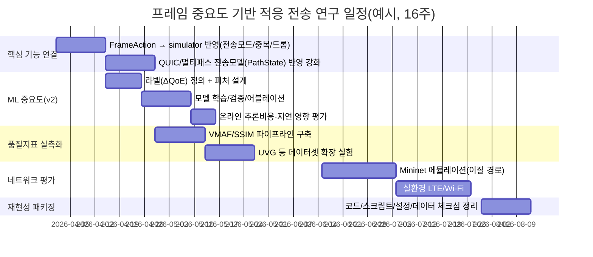

# 프레임 단위 콘텐츠 중요도 기반 적응형 비디오 전송 연구방향 심화 리서치 보고서

## 실행 요약

**활성 커넥터(전체 목록)**: GitHub (1개) fileciteturn21file0L1-L1  

본 리서치는 먼저 GitHub 저장소 **`knougitrepos/network`**를 코드 수준에서 확인해 “현재 무엇이 구현되어 있고(재사용 가능), 무엇이 비어 있는지(연구 기여/구현 우선순위)”를 정리한 뒤, QUIC/MPQUIC/MPTCP, Mininet, FFmpeg/ffprobe, VMAF, 코덱(H.264/HEVC) 관련 **표준/RFC 및 1차 자료**로 연구 방향을 정밀화한다. citeturn0search2turn1search2turn1search0turn0search3turn0search0turn2search0turn4search1turn3search0  

핵심 결론은 다음과 같다.

1. 이 저장소는 “TCP batching”이 아니라 **프레임 중요도 기반(휴리스틱→ML→RL) 적응 전송**을 명시적으로 목표로 한다. 특히 Stage A(importance scorer)와 Stage B(action mapping)가 이미 분리된 형태로 존재하며, 전송모드(신뢰/비신뢰/중복/드롭)까지 행동 공간이 정의되어 있어 연구확장에 유리하다. fileciteturn21file0L1-L1 fileciteturn25file0L1-L1 fileciteturn26file0L1-L1 fileciteturn32file0L1-L1  
2. 현재 가장 큰 공백은 **(A) “학습 가능한 ML 중요도 스코어러”의 실제 파이프라인(라벨/피처/학습/검증/어블레이션)**과 **(B) QUIC DATAGRAM/Stream 및 멀티패스 스케줄링을 시뮬레이터→Mininet→실환경으로 일관되게 관통시키는 실험체계**다. fileciteturn28file0L1-L1 fileciteturn22file0L1-L1 citeturn1search2turn1search5turn0search0  
3. 표준 관점에서 “부분 신뢰성(partial reliability)”의 정합한 구현 기반은 **QUIC DATAGRAM(RFC 9221)**이며, 멀티패스는 **IETF Multipath QUIC 인터넷 드래프트**가 메커니즘을 제공하지만 **스케줄링(어떤 프레임을 어떤 경로로)**은 의도적으로 비워 두어 연구 기여 지점이 명확하다. citeturn1search2turn1search0turn1search5  
4. 비교 베이스라인은 (논문) **MPR-QUIC**, (프로토타입/아티팩트) **MPQUIC 프로젝트 계열**, (표준+실구현) **Linux MPTCP**를 함께 두는 구성이 가장 방어적이다. citeturn3search0turn5search2turn5search9turn0search3turn0search12  

## GitHub 저장소 기반 현황 진단

### 저장소 구조와 관련 모듈 요약

저장소는 “프레임 트레이스 기반 workload → importance scoring(Stage A) → action mapping(Stage B) → transport model(TCP/QUIC) → QoE/성능지표(eval) → RL 확장(rl)”로 이어지는 연구형 파이프라인을 갖는다. fileciteturn21file0L1-L1 fileciteturn23file0L1-L1 fileciteturn24file0L1-L1  

특히 `docs/initial_plan.md`는 연구 범위/제외 항목, Stage A/B/RL 단계 목표, 지표 및 objective 가중치까지 명시해 **논문형 연구계획 문서의 기준점** 역할을 한다. fileciteturn32file0L1-L1 fileciteturn34file0L1-L1  

### 열람한 파일 전체 목록과 파일별 핵심 발견

아래는 본 리서치에서 **실제로 열람한 모든 파일(14개)**과, 각 파일이 연구방향에 주는 핵심 발견이다(각 행마다 해당 파일의 filecite 포함).

| 파일(열람 목록 전체) | 핵심 발견 | 연구방향에의 함의 |
|---|---|---|
| `README.md` fileciteturn21file0L1-L1 | 연구가 “TCP batching”이 아니라 **프레임 중요도 기반 적응 전송**이며 Stage A/B, QUIC 모델, QoE 지표, RL 확장을 목표로 함을 명시 | 문제정의/범위 설정이 이미 정리됨 → “ML+실험 재현성” 중심으로 기여를 구체화하면 됨 |
| `docs/initial_plan.md` fileciteturn32file0L1-L1 | Stage A(v1 휴리스틱, v2 ML, v3 RL), Stage B(FrameAction), 지표/가중치, 제외 항목 명시 | 학위/논문 계획을 “코드와 동기화”할 수 있는 기준 문서 확보 |
| `requirements.txt` fileciteturn31file0L1-L1 | numpy/pandas/scikit-learn/gymnasium 등 연구용 의존성 고정 | 재현성(환경 고정) 기반 마련. Mininet/FFmpeg/VMAF는 별도 설치로 관리 필요 |
| `scripts/extract_video_trace.py` fileciteturn29file0L1-L1 | `ffprobe -show_frames`로 frame type(I/P/B), pkt_size 등을 뽑아 trace CSV 생성 | 다양한 비디오/코덱(H.264/HEVC)로 데이터 확장하기 쉬움(다만 현재는 프레임 특징량이 제한적) |
| `core/workload.py` fileciteturn24file0L1-L1 | trace를 로드하고 `display_deadline_ms = pts + duration + playback_buffer`로 “deadline”을 생성 | deadline-aware 정의가 코드로 고정됨 → 지표(온타임/late) 정의의 일관성이 확보 |
| `core/transport.py` fileciteturn23file0L1-L1 | TCPTransportModel과 QUICTransportModel(멀티패스 path state/손실 모델 포함) 존재 | QUIC/멀티패스를 “시뮬레이션 모델”에서 먼저 실험 가능. 다만 실제 QUIC 스택 연동은 별도 |
| `core/simulator.py` fileciteturn22file0L1-L1 | run_simulation이 아직 legacy batch/flush 형태가 강함. 동시에 goodput/latency/QoE 기록 로직이 있음 | Stage A/B의 FrameAction 효과가 전송 결과에 “물리적으로” 반영되도록 리팩토링이 최우선 |
| `policy/importance.py` fileciteturn25file0L1-L1 | HeuristicImportanceScorer: IPB 타입/슬랙/키프레임 보너스로 0~1 스코어 | ML scorer는 동일 인터페이스로 교체 가능(구조적으로 확장 준비 완료) |
| `policy/action.py` fileciteturn26file0L1-L1 | FrameAction 5종(신뢰 단일/신뢰 멀티/비신뢰/중복/드롭)과 규칙 기반 선택 | “스코어→행동”이 명확. 연구기여는 (i) 스코어 정확도, (ii) 행동/경로 매핑 최적화로 분리 가능 |
| `policy/legacy.py` fileciteturn27file0L1-L1 | 과거 batch/flush 정책 호환 레이어 | 기존 실험/비교 유지에 유용. 다만 논문 메시지는 legacy보다 FrameAction 중심으로 정리 필요 |
| `eval/metrics.py` fileciteturn28file0L1-L1 | late/keyframe late/decodable GOP/useful_goodput, `rebuffer_ratio`, `ssim_proxy`, `block_completion_ratio` 제공 | 요구 지표(BufRatio/aSSIM/Block completion/goodput/latency)로 확장 가능한 뼈대. 하지만 SSIM/VMAF 실측 필요 |
| `eval/scoring.py` fileciteturn33file0L1-L1 | metric들을 종합해 objective score 산정(가중치 적용) | 모델/정책 비교를 “단일 점수”로도 할 수 있음(단, 세부지표 동시 보고 필요) |
| `core/constants.py` fileciteturn34file0L1-L1 | 지표 가중치/상수 정의 | 논문에서 “목표함수”를 명시적으로 정의할 근거가 코드에 존재 |
| `rl/env.py` fileciteturn30file0L1-L1 | Gymnasium 기반 RL 환경 스켈레톤. 현재는 TCP 모델 기반이고 action의 효과가 제한적 | RL은 v3로 두되, 우선 simulator에서 action→전송결과 연결을 완성해야 RL이 의미 있음 |

## 연구 목표 대비 갭과 우선 기여 선택지

### 갭 분석

저장소는 “연구 방향의 골격”이 이미 있으나, 학술적으로 강한 기여를 만들려면 다음 갭을 메워야 한다.

- **ML 기반 중요도 스코어링의 실재화**: 현재 Stage A는 휴리스틱 구현이 중심이며, v2(ML)의 데이터/라벨/학습/검증이 코드로 제공되지 않는다. fileciteturn25file0L1-L1 fileciteturn32file0L1-L1  
- **“부분 신뢰성”의 표준 기반 실행**: QUIC에서는 신뢰 전송은 STREAM, 비신뢰 전송은 DATAGRAM(RFC 9221)으로 정합적이다. 저장소의 FrameAction은 이를 개념적으로 담지만, 실제 QUIC 스택과의 바인딩은 남아 있다. fileciteturn26file0L1-L1 citeturn1search2turn5search5  
- **멀티패스 스케줄링(핵심 연구 기여점) 정식화**: Multipath QUIC 표준화 문서는 다중 경로 메커니즘을 정의하지만 “스케줄링”은 규정하지 않는다. 즉, **프레임 중요도·마감시간·경로상태 기반 스케줄링** 자체가 논문의 기여가 된다. citeturn1search0turn1search5  
- **지표의 ‘proxy→실측’ 전환**: `ssim_proxy`는 실제 SSIM/VMAF가 아니므로, 논문-level 결과는 VMAF/SSIM 실측으로 보완해야 한다. fileciteturn28file0L1-L1 citeturn2search0turn0search13  

### 우선순위 기여 선택지(현실적 2안)

아래 두 가지 중 하나를 “주 기여”로 명확히 잡는 것이 좋다(둘 다 하면 가장 좋지만, 일정/리스크를 고려한 선택지).

| 선택지 | 핵심 기여 | 장점 | 리스크 |
|---|---|---|---|
| A안: **ML 중요도 스코어링 중심** | IPB 기반을 넘어서 콘텐츠/상황 피처로 중요도를 더 잘 추정 → 같은 전송자원에서 QoE 개선 | 논문 novelty가 명확(“정적 IPB → 동적 ML”) | 라벨 정의와 일반화(콘텐츠/코덱) 검증이 어려울 수 있음 |
| B안: **멀티패스+부분신뢰 스케줄링 중심** | importance를 입력으로 받아 QUIC DATAGRAM/STREAM + path 선택 + 중복/만료 정책 최적화 | 표준이 스케줄링을 비워둔 덕에 시스템 기여가 강함 citeturn1search5 | MPQUIC 구현/실험 인프라 구축 부담 |

현 저장소는 Stage A/B 인터페이스가 분리돼 있으므로, **A안을 주 기여로 두고 B안을 2차 기여(규칙 기반)로 두는 전략이 가장 안전**하다. fileciteturn25file0L1-L1 fileciteturn26file0L1-L1  

## 도구·데이터·코덱·실험 설계

### 필수 소프트웨어/하드웨어/도구

- **FFmpeg/ffprobe**: frame-level trace 추출의 표준적 도구이며 `-show_frames`로 프레임 단위 정보를 확인할 수 있다. fileciteturn29file0L1-L1 citeturn2search12  
- **VMAF**: entity["company","넷플릭스","streaming company"]가 공개한 오픈소스 품질평가 툴킷으로 `libvmaf` 및 관련 metric(PSNR/SSIM 등)도 포함한다. citeturn2search0  
- **Mininet**: 단일 머신에서 커널/스위치/애플리케이션 코드를 포함한 “현실적” 네트워크를 빠르게 구성하는 에뮬레이터로, 연구/교육에 널리 사용된다. citeturn0search0  
- **실환경 멀티홈**: Wi‑Fi + LTE/5G(테더링/동글) 2경로를 확보. 멀티패스의 동기(대역폭 집계/복원력) 자체는 MPTCP 표준 문서에서도 설명된다. citeturn0search3turn0search12  

### 데이터셋 및 코덱

- **H.264(AVC)**: I/P/B와 GOP 의존성을 기반으로 “중요도”를 정의하기 좋은 출발점이다. H.264는 ITU-T/ISO 표준이며, RTP payload 포맷 RFC에서도 H.264/14496-10 AVC를 전제로 NAL 구조 등을 정리한다. citeturn4search0  
- **HEVC(H.265)**: HEVC는 더 높은 압축 효율(동일 품질 대비 비트레이트 절감)을 목표로 하는 표준이며, 연구 확장(코덱 일반화)에서 중요하다. citeturn4search1  
- **UVG 4K 데이터셋**: 4K 50/120fps 시퀀스를 제공하며 코덱 분석/개발 목적의 공개 데이터셋으로 문서화되어 있다(라이선스 BY‑NC). citeturn2search14  

데이터셋/콘텐츠 옵션 비교는 다음과 같다.

| 데이터 | 활용 목적 | 장점 | 주의점 |
|---|---|---|---|
| 현재 저장소 Trace 기반 | 회귀 테스트/빠른 반복 | 즉시 실행 가능 | 다양성 부족(과적합 위험) |
| UVG 4K | 논문 핵심 실험 | 고해상도·고fps·공식 문서 | 방대한 용량, BY‑NC 준수 citeturn2search14 |
| 사용자 생성 콘텐츠 | 일반화 검증 | 현실적 분포 | 저작권/배포 제약 |

### ML 모델/라벨/피처(프레임 중요도)

저장소는 ImportanceScorer 인터페이스가 이미 존재하며, 휴리스틱 구현은 “IPB + slack + keyframe bonus”로 설계되어 있다. fileciteturn25file0L1-L1  
ML로 확장할 때 가장 방어적인 라벨 정의는 **ΔQoE 기반 중요도**다: 특정 프레임을 드롭/지연시켰을 때 rebuffer(버퍼링)와 품질(SSIM/VMAF) 변화가 큰 프레임을 “중요”하다고 라벨링한다. 이는 MPR-QUIC이 deadline 기반 폐기/우선순위 전송을 핵심 아이디어로 제시하는 것과 정합하다. citeturn3search0turn0search13turn2search0  

| 분류 | 후보 | 설명 |
|---|---|---|
| 라벨 | Δrebuffer + ΔVMAF(또는 ΔSSIM) | 프레임 단위 “드롭/late” 반사실(counterfactual) 실험으로 생성 |
| 최소 피처 | frame_type, key_frame, payload_bytes, slack_ms, GOP 위치 | 현재 trace/workload에서 바로 확보 가능 fileciteturn24file0L1-L1 |
| 확장 피처 | 최근 late 비율, buffer level, path별 RTT/loss, motion/scene proxy | 멀티패스/실환경에서 중요해짐 citeturn1search5 |
| 모델 | GBDT/RandomForest, 경량 MLP, (선택) 시퀀스 모델 | 온라인 추론 비용과 재현성 우선 |

## 평가 지표 정의와 측정 방법

요구된 지표(BufRatio, aSSIM, block completion ratio, goodput, latency)를 “정의→측정법→저장소 구현/확장 포인트”로 정리한다.

| 지표 | 정의(권장) | 측정 방법(권장) | 저장소 현황/확장 |
|---|---|---|---|
| **BufRatio** | 총 재생시간 대비 stall(버퍼링) 시간 비율 | 플레이어/시뮬에서 stall interval 누적 / total play time | 저장소 `rebuffer_ratio`는 연속 late 구간 기반 proxy fileciteturn28file0L1-L1 → stall-time 기반으로 업그레이드 권장 |
| **aSSIM** | stall/late를 반영한 평균 SSIM 변형(예: stall 구간 SSIM=0) | 프레임별 SSIM 계산 후 평균(가중 포함) | 저장소 `ssim_proxy`는 실제 SSIM이 아님 fileciteturn28file0L1-L1, SSIM 정의는 원 논문 근거 citeturn0search13 |
| **block completion ratio** | deadline 내 “전송 단위 블록” 완료 비율 | 블록 정의(GOP/segment/frame 묶음) 고정 후, deadline 내 도착 여부 집계 | 저장소는 GOP 단위 `block_completion_ratio` 제공 fileciteturn28file0L1-L1; MPR-QUIC도 data block completion을 핵심 결과로 보고 citeturn3search0 |
| **goodput** | 유효 데이터 전달량(필요 시 deadline 내 도착분만) | bytes delivered / time (또는 useful bytes만) | 저장소 `goodput_bytes`, `useful_goodput_bytes` 존재 fileciteturn28file0L1-L1 |
| **latency** | 프레임/블록 전달 지연(평균, P95) | 도착시간-생성시간(또는 send time) 통계 | 저장소 mean/p95 구조 제공(시뮬 산출) fileciteturn22file0L1-L1 |

## QUIC/MPQUIC/TCP 통합과 베이스라인

### QUIC에서 부분 신뢰성 구현

QUIC 코어는 secure transport/stream/migration 등을 제공한다. citeturn0search2  
RFC 9221은 QUIC에 **unreliable DATAGRAM**을 추가하며, DATAGRAM이 재전송되지 않고, 애플리케이션이 datagram 의미/다중화(flow 식별)를 책임져야 함을 명시한다. citeturn1search2turn5search5  
따라서 저장소의 FrameAction 중 “unreliable datagram” 개념은 표준에 정합하며, 실제 QUIC 스택(예: `aioquic`)은 `send_datagram_frame()` 같은 API를 노출한다. citeturn5search6  

### MPQUIC(멀티패스 QUIC)와 연구 기여

Multipath QUIC은 표준화가 진행 중인 Internet-Draft이며, 여러 path를 동시에 사용하는 메커니즘을 정의한다. citeturn1search0turn1search5  
동시에, “applications using QUIC schedule traffic over multiple paths”는 명시적으로 범위 밖으로 남겨 둔다. citeturn1search5  
즉, **프레임 중요도+deadline 기반 멀티패스 스케줄링**은 “표준 메커니즘 위에 올라가는 연구 기여”로 위치시킬 수 있다.

MPQUIC 실험/구현 베이스로는 Multipath QUIC 프로젝트 사이트와, 관련 MP-QUIC 코드 계통이 존재한다. entity["people","Quentin De Coninck","multipath quic researcher"]의 프로젝트 소개는 프로토타입과 아티팩트를 제공한다고 명시한다. citeturn5search2turn5search9turn5search14  

### MPTCP(멀티패스 TCP) 베이스라인

MPTCP는 표준적으로 TCP 확장을 통해 멀티패스를 제공하는 신뢰 바이트스트림이다. citeturn0search3turn0search9  
Linux 커널 문서 및 mptcp.dev는 MPTCP가 다중 인터페이스를 활용해 대역폭 집계/최저 지연 선호/페일오버를 제공한다고 설명한다. citeturn0search11turn0search12  

이는 “프레임별 부분 신뢰성”이라는 당신 연구 목표와 직접 같지는 않지만, 멀티패스 신뢰 전송의 강력한 기준선으로 비교 가치가 높다.

### 논문 베이스라인: MPR-QUIC

MPR-QUIC 논문은 **멀티패스 + 부분 신뢰성**을 결합하고, **priority(프레임 중요도)와 deadline**을 고려한 스케줄러를 제시하며 rebuffer time 감소 및 completion ratio 증가를 보고한다. (해당 논문은 가장 직접적인 관련연구/비교대상). entity["people","Biao Han","mpr-quic author"] citeturn3search0  

## 일정, 리스크, 재현성(아티팩트) 계획

### 우선순위 마일스톤

저장소 현재 상태를 기준으로, “논문 설득력”을 가장 빨리 올리는 순서는 다음과 같다.

1) **Simulator에서 FrameAction이 전송 결과에 완전히 반영되도록 리팩토링**(현재는 legacy batch/flush 영향이 큼) fileciteturn22file0L1-L1 fileciteturn26file0L1-L1  
2) **ML ImportanceScorer(v2) 구현 + 어블레이션**(IPB-only 대비 개선을 정량화) fileciteturn25file0L1-L1  
3) **Proxy 지표 → 실측 지표(VMAF/SSIM) 전환**(핵심 결과 신뢰도 확보) fileciteturn28file0L1-L1 citeturn2search0turn0search13  
4) **Mininet 에뮬레이션**(loss/RTT/bw가 다른 2경로에서 정책 비교) citeturn0search0  
5) **실환경 LTE/Wi‑Fi**(동적 환경에서 강건성 증명)

### Mermaid 타임라인(라벨 한글)



### 리스크 및 대응

- **Multipath QUIC 표준/구현 변동**: multipath는 Internet-Draft로 변화 가능. 대응: 스케줄러 로직을 transport-agnostic하게 두고, path 메커니즘은 core/transport 추상화로 흡수. citeturn1search0turn1search5 fileciteturn23file0L1-L1  
- **라벨 품질/일반화**: ΔQoE 라벨이 콘텐츠/인코딩 설정에 과적합될 수 있음. 대응: UVG 등 다양한 콘텐츠로 교차검증 + H.264→HEVC 전이 성능 보고. citeturn2search14turn4search1  
- **Proxy 지표의 신뢰성 한계**: `ssim_proxy`는 “실제 품질”이 아니라 대체지표. 대응: 논문 주 결과는 VMAF/SSIM 실측으로 제시하고 proxy는 디버깅/회귀테스트 용도로 제한. fileciteturn28file0L1-L1 citeturn2search0turn0search13  

### 재현성(Artifact) 계획

- **코드**: Stage A/B/Transport/Simulator + Mininet 실험 스크립트, seed 고정(모델 학습 포함) fileciteturn31file0L1-L1  
- **데이터**: trace 생성 스크립트(FFprobe) + 입력 영상/인코딩 설정 기록 + 체크섬; UVG는 다운로드 링크+라이선스 문구+체크섬 citeturn2search14  
- **지표**: BufRatio/aSSIM/block completion/goodput/latency 산정 스크립트 고정 및 버전 태깅 fileciteturn28file0L1-L1  
- **환경**: `requirements.txt` + (권장) Dockerfile에 FFmpeg+libvmaf 포함. VMAF는 오픈소스 `libvmaf` 제공. citeturn2search0  

## 다음 단계 로컬 실행 명령

아래는 “저장소 실행 흐름 + 연구 확장”을 바로 시작하는 최소 세트다. (URL은 코드 블록으로 제공)

```bash
# 클론
git clone https://github.com/knougitrepos/network.git
cd network

# 가상환경 + 의존성
python -m venv .venv
source .venv/bin/activate
pip install -U pip
pip install -r requirements.txt

# 트레이스 생성(FFmpeg/ffprobe 필요)
python scripts/extract_video_trace.py --help
# 예시:
python scripts/extract_video_trace.py \
  --input tmp/video-traces/bbb_720_10s.mp4 \
  --output data/video-traces/bbb_720p_trace.csv \
  --playback-buffer-ms 50

# 시뮬/환경 스모크(구현 상태에 따라 entrypoint는 조정)
python rl/env.py

# 노트북 기반 분석(선택)
pip install jupyterlab
jupyter lab
```

(선택) 비교/참고 구현:

```bash
# QUIC WG multipath 드래프트 저장소
git clone https://github.com/quicwg/multipath.git

# MPQUIC 계열 구현(참고)
git clone https://github.com/qdeconinck/mp-quic.git
```

