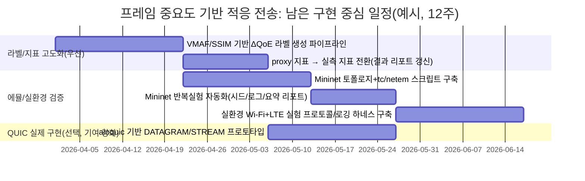

# 프레임 단위 콘텐츠 중요도 기반 적응형 비디오 전송 연구방향 심화 리서치 보고서

## 실행 요약

**활성 커넥터(전체 목록)**: GitHub fileciteturn53file0L1-L1  

저는 현재 연구를 **“TCP batching 최적화”가 아니라**, **H.264 IPB 프레임 중요도 기반(휴리스틱→ML→RL) 적응형 전송 행동 결정**으로 정렬해 두었고, 그 정체성이 저장소 문서·코드에 일관되게 반영되어 있음을 확인했다. fileciteturn53file0L1-L1 fileciteturn36file0L1-L1  

특히 제가 의심했던 “ML 라벨·피처·모델 옵션”은 **이미 코드에 상당 부분 반영**되어 있다. 구체적으로 (1) **피처 벡터 규격(13차원)**이 코드로 고정되어 있고, (2) **ΔQoE proxy 라벨 생성 스크립트**가 존재하며, (3) **외부 라벨 CSV 학습 경로**까지 지원하고, (4) **MLImportanceScorer가 시뮬레이터 정책(`frame_action_ml_adaptive`)에 연결**되어 있다. fileciteturn41file0L1-L1 fileciteturn48file0L1-L1 fileciteturn40file0L1-L1 fileciteturn43file0L1-L1 fileciteturn38file0L1-L1  

반면 “에뮬레이션(Mininet)·실환경(LTE/Wi‑Fi)” 실험 설계는 **문서 수준으로는 명확히 존재**하지만, 이를 실행하는 **Mininet 토폴로지/스크립트/측정 하네스 코드는 아직 저장소에 구현되어 있지 않은 것으로 보인다**(검색/열람 범위 기준). fileciteturn36file0L1-L1 fileciteturn45file0L1-L1 citeturn0search0  

따라서 저의 “다음 기여 선택”은 다음 두 갈래 중 하나를 명확히 잡는 방식이 합리적이다.  
(가) **라벨 고도화(실측 VMAF/SSIM 기반 ΔQoE)**를 주 기여로 하여 ML 중요도 스코어링의 학술적 설득력을 강화하거나, (나) **Mininet→실환경 검증 파이프라인**을 주 기여로 하여 시스템 논문의 실증성을 강화하는 것이다. 각각은 기존 QUIC 표준(특히 DATAGRAM) 및 멀티패스 QUIC의 “스케줄링 공백”과도 잘 맞는다. citeturn1search2turn1search5turn2search0turn0search13  

## GitHub 저장소 정밀 점검

### 저장소 구조와 모듈 경계

저장소는 “프레임 트레이스(워크로드) → 중요도 스코어링(Stage A) → 행동 매핑(Stage B) → 전송/완료시간 추정(Transport) → QoE 지표/스코어링(eval) → 회귀 스모크/리포트 스크립트(scripts)” 흐름으로 구성되어 있다. fileciteturn53file0L1-L1  

또한 문서 레이어가 강하며, `research_goal.md`가 연구 정체성·연관논문 3편 구조·2단 아키텍처·3계층 실험체계를 명확히 정의한다. fileciteturn36file0L1-L1  

### 이번 리서치에서 **실제로 열람한 파일 전체 목록**과 파일별 핵심 발견

아래 표는 제가 이번 리서치에서 “직접 열람(fetch)”한 파일 전부이며(중복/검색결과 제외), 각 파일마다 핵심 발견을 요약한다(각 행에 filecite 첨부).

| 열람 파일(전체) | 핵심 발견 | 연구방향에의 함의 |
|---|---|---|
| `README.md` fileciteturn53file0L1-L1 | 프레임 중요도 기반 적응 전송이 핵심이며, scripts 재현 커맨드(라벨 생성·ML 학습·스모크·리포트)까지 문서화 | “이미 구현된 것”과 “앞으로 할 것(실 QUIC/Mininet)”의 경계가 명확 |
| `requirements.txt` fileciteturn31file0L1-L1 | numpy/pandas/scikit-learn/gymnasium 등 연구환경 고정 | 재현성 기반 확보(단, Mininet/FFmpeg/VMAF는 별도 설치 필요) |
| `docs/initial_plan.md` fileciteturn32file0L1-L1 | 초기 설계(고정) 문서: 단계/지표/범위 정의 | 논문 작성 시 “초기 가정”의 근거로 활용 가능 |
| `docs/research_goal.md` fileciteturn36file0L1-L1 | “TCP batching이 아니다” 정체성 선언 + 2단(Stage A/B) + 3계층 실험체계(시뮬·Mininet·실환경) + v2(ML), v3(RL) 계획 | 연구 서사·비교군(연관논문 3편)·실험 프레임이 정리돼 있어, 구현/실증을 채우면 됨 |
| `research_direction_advice.md` fileciteturn37file0L1-L1 | 연관논문 3편과 “TCP batching 아님” 선언의 긴장을 “교차계층 통합”으로 재정의하고, 코드 수정 우선순위를 제안 | 발표/논문 related work 서사를 안정화하는 데 직접 사용 가능 |
| `docs/changelog/20260330_ml_importance_scorer_scaffold.md` fileciteturn38file0L1-L1 | MLImportanceScorer 스캐폴딩+시뮬레이터 연결, 실패 시 heuristic 폴백, 결과 컬럼 `importance_scorer_type` 추가 | “ML이 코드에 없다”는 주장은 현재 코드 기준으로 틀림(이미 연결됨) |
| `docs/changelog/20260330_ml_model_training_bootstrap.md` fileciteturn39file0L1-L1 | 학습 스크립트(`train_importance_model.py`) 추가, bootstrap 라벨과 model_path 연동, 향후 ΔQoE 라벨로 교체 필요 명시 | ML 파이프라인이 “부재”가 아니라 “bootstrap→고도화” 단계로 구현돼 있음 |
| `docs/changelog/20260330_delta_qoe_label_bootstrap.md` fileciteturn50file0L1-L1 | ΔQoE proxy 라벨 생성 스크립트(`build_delta_qoe_labels.py`) 추가 및 컬럼 정의 | “라벨 생성”이 문서뿐 아니라 코드로 존재(단, proxy라는 한계가 명시됨) |
| `docs/changelog/20260330_train_with_external_labels.md` fileciteturn51file0L1-L1 | 외부 라벨 CSV(`delta_qoe_norm`)를 학습에 사용하는 경로 추가 | 라벨 고도화(VMAF 기반 등)를 “외부 CSV 생성”으로 자연스럽게 연결 가능 |
| `docs/analyze/20260330_deep_report2_implementation_alignment_check.md` fileciteturn45file0L1-L1 | 과거 보고서의 “ML 파이프라인 부재/FrameAction 미반영” 서술이 최신 코드와 불일치함을 기록 | 제가 앞으로 작성할 보고서는 “이미 구현된 범위”를 정확히 전제해야 함 |
| `core/transport.py` fileciteturn56file0L1-L1 | TCPTransportModel과 QUICTransportModel(프로토타입), PathState(손실/대역/RTT) | QUIC/멀티패스는 아직 “시뮬 모델” 수준. 실제 RFC 기반 구현은 후속 과제 |
| `core/workload.py` fileciteturn24file0L1-L1 | video trace 로드 후 `display_deadline_ms`를 구성(재생버퍼 고려) | deadline-aware 정의가 코드로 고정되어 지표 일관성이 좋음 |
| `core/constants.py` fileciteturn34file0L1-L1 | 목표함수 가중치/그리드/상수 | 논문에서 objective를 “코드와 같은 값”으로 재현 가능 |
| `core/simulator.py` fileciteturn43file0L1-L1 | `frame_action_adaptive`/`frame_action_ml_adaptive`가 시뮬에 이미 연결되고, queue_bytes/estimated_batch_gain 같은 cross-layer 피처가 action 선택에 들어감 | “Stage A/B 구현이 없다”가 아니라, “이제 실험 다양화/실측 라벨/실환경 검증”으로 넘어갈 단계 |
| `policy/action.py` fileciteturn26file0L1-L1 | FrameAction 5종(신뢰/비신뢰/중복/드롭)과 선택규칙 | 제 연구의 ‘행동 공간’이 이미 정의돼 있어, ML은 스코어 추정에 집중 가능 |
| `policy/importance.py` fileciteturn41file0L1-L1 | 13차원 feature builder + HeuristicImportanceScorer + MLImportanceScorer(피클 로드/폴백) + NetworkState 확장(queue_bytes 등) | “피처/모델 인터페이스”가 코드로 고정됨. 라벨만 고도화하면 ML 평가가 즉시 가능 |
| `policy/legacy.py` fileciteturn42file0L1-L1 | PolicyConfig에 `model_path` 포함, `frame_action_ml_adaptive` 정책 해석 | ML 모델 파일을 연결해 실험하는 경로가 정식으로 지원됨 |
| `eval/metrics.py` fileciteturn49file0L1-L1 | `rebuffer_ratio`, `ssim_proxy`, `block_completion_ratio` 등 QoE proxy 지표 구현 | BufRatio/aSSIM 요구를 충족하려면 proxy→실측(SSIM/VMAF) 전환이 다음 단계 |
| `eval/scoring.py` fileciteturn33file0L1-L1 | 여러 지표를 종합한 objective score 산정 | 정책 비교를 “단일 점수+세부지표”로 정리 가능 |
| `scripts/extract_video_trace.py` fileciteturn29file0L1-L1 | `ffprobe -show_frames` 기반 trace 생성 | 다양한 콘텐츠/코덱 확장에 용이(다만 motion/scene 피처는 추가 필요) citeturn2search12 |
| `scripts/build_delta_qoe_labels.py` fileciteturn48file0L1-L1 | 프레임 drop 시나리오 기반 ΔQoE proxy 라벨 생성(`delta_qoe_norm`) | “라벨 생성”이 코드에 존재. 단, 실제 VMAF 기반 ΔQoE로 고도화 여지 |
| `scripts/train_importance_model.py` fileciteturn40file0L1-L1 | RandomForestRegressor로 bootstrap/외부라벨 학습 지원 | ML 모델 옵션이 최소 1개는 구현됨. GBDT 등 추가는 선택 |
| `scripts/smoke_policy_regression.py` fileciteturn54file0L1-L1 | 주요 결과 컬럼/비율 범위/액션 카운트 합을 회귀 점검 | 실험 자동화/CI 기반으로 확장하기 쉬움 |
| `scripts/export_policy_action_report.py` fileciteturn55file0L1-L1 | 정책별 action count 및 핵심 지표 요약 CSV/PNG 출력 | 보고서/논문 그림 생성 자동화 기반 |
| `data/video-traces/bbb_720p_delta_qoe_labels.csv` fileciteturn52file0L1-L1 | ΔQoE proxy 라벨 예시 데이터. I-frame의 `delta_qoe_norm`이 크게 나타남 | IPB 중요도 기반 가정이 데이터로 확인됨(단, proxy QoE에 기반) |
| `rl/env.py` fileciteturn30file0L1-L1 | Gymnasium 기반 RL 환경 스켈레톤 | RL(v3)은 “가능성”은 열려 있으나, 논문 1차 목표는 ML(v2)+검증이 안전 |

## 연구방향 정합화와 기여 선택

### 표준/선행연구 관점에서의 정합성

제가 목표로 하는 “부분 신뢰성 전송”은 QUIC에서 **STREAM(신뢰)**과 **DATAGRAM(비신뢰)**의 공존으로 가장 정합적으로 설명된다. QUIC DATAGRAM 표준(RFC 9221)은 datagram이 재전송되지 않으며, 애플리케이션이 datagram의 의미/다중화(flow 식별)를 책임져야 함을 명시한다. entity["organization","국제 인터넷 표준화 기구 IETF","internet standards org"] citeturn1search2turn5search5  

또한 멀티패스 QUIC은 Internet-Draft로 표준화가 진행 중이며, 메커니즘은 제공하지만 “스케줄링”을 규정하지 않는다는 점이 제 기여 지점을 명확히 만들어 준다. citeturn1search0turn1search5  

논문 베이스라인으로는 **MPR-QUIC**이 프레임 우선순위·deadline-aware 전송을 멀티패스/부분신뢰성과 결합해 QoE 개선을 보고한다(관련연구로 매우 직접적). entity["people","Biao Han","mpr-quic author"] citeturn3search0  

### 구현 중심 기여 선택(우선순위)

현재 코드 반영 상태를 기준으로 저는 다음 중 하나를 “주 기여”로 택하는 편이 가장 효율적이다.

1) **실측 라벨/지표 고도화(추천 1순위, 논문 설득력 상승)**  
저장소의 ΔQoE 라벨은 `compute_all_video_metrics()` 기반 proxy QoE(`ssim_proxy` 포함)이므로, 이를 **VMAF/SSIM 기반 실측 ΔQoE 라벨**로 교체하면 ML 결과의 신뢰도가 크게 오른다. fileciteturn48file0L1-L1 fileciteturn49file0L1-L1 entity["company","넷플릭스","streaming company"] citeturn2search0turn0search13  

2) **Mininet→실환경 검증 파이프라인(추천 2순위, 시스템 실증성 상승)**  
문서에는 3계층 실험체계(시뮬→Mininet→Wi‑Fi+LTE)가 정의돼 있으나, 이를 실행하는 코드/스크립트는 아직 확인되지 않았다. Mininet은 표준적 에뮬레이션 도구이므로, 이를 붙이는 순간 연구의 “시스템 논문” 완성도가 상승한다. fileciteturn36file0L1-L1 citeturn0search0  

## ML 라벨·피처·모델 및 실험설계의 “코드 반영 여부” 확인 결과

요청하신 대로, **(A) ML 라벨/피처/모델 옵션**과 **(B) 에뮬·실환경 실험 설계**가 “이미 코드에 반영됐는지”를 확인해, 보고서 하단에 “이미 반영(OK)”과 “앞으로 해야 할 항목(TODO)”로 구분한다.

### A. ML 라벨·피처·모델 옵션

| 항목 | 코드 반영 여부 | 근거(파일) | 해석 |
|---|---|---|---|
| 피처 벡터 규격(13차원) | **OK** | `build_importance_features()` fileciteturn41file0L1-L1 | IPB one-hot + slack + 네트워크/큐 상태까지 포함(교차계층 입력으로 설계됨) |
| Heuristic→ML scorer 교체(인터페이스) | **OK** | `ImportanceScorer`, `MLImportanceScorer` fileciteturn41file0L1-L1 | 피클 모델 로드/추론/폴백 포함 |
| ML 학습 스크립트(bootstrap) | **OK** | `train_importance_model.py` fileciteturn40file0L1-L1 fileciteturn39file0L1-L1 | RandomForestRegressor로 학습/저장/메타 기록 |
| 외부 라벨 CSV 학습 경로 | **OK** | `--label-csv`, `--label-column` fileciteturn40file0L1-L1 fileciteturn51file0L1-L1 | “라벨 고도화”를 외부 CSV 생성으로 연결 가능 |
| ΔQoE proxy 라벨 생성 | **OK(Proxy)** | `build_delta_qoe_labels.py` fileciteturn48file0L1-L1 | drop 시나리오+proxy QoE로 delta 생성 |
| 실측 VMAF/SSIM 기반 ΔQoE 라벨 | **TODO** | 문서상 필요성은 명시, 코드는 부재 fileciteturn50file0L1-L1 | 현재는 `ssim_proxy` 기반. 실측 라벨이 핵심 고도화 |
| 모델 다양화(GBDT 등) | **TODO(선택)** | 문서에 v2 후보 언급 fileciteturn36file0L1-L1 | RandomForest만으로도 논문은 가능하나, 성능/일반화 검증에 도움 |

### B. 실험 설계(에뮬·실환경)

| 항목 | 코드 반영 여부 | 근거(파일) | 해석 |
|---|---|---|---|
| 시뮬레이터 기반 1차 검증 | **OK** | `core/simulator.py` fileciteturn43file0L1-L1 | frame_action/ML 경로가 이미 통합되어 대규모 sweep 가능 |
| Mininet 에뮬레이션 설계(문서) | **OK(문서)** | 3계층 실험체계 명시 fileciteturn36file0L1-L1 | 설계는 있으나, 자동 실행 스크립트는 확인되지 않음 |
| Mininet 실행 코드/토폴로지/측정 하네스 | **TODO** | 저장소 내 구현 파일 열람/검색 기준 미확인 fileciteturn36file0L1-L1 | 실제로는 `mn` 토폴로지, tc/netem, 로그 수집이 필요 |
| 실환경(Wi‑Fi + LTE/5G) 실험 설계(문서) | **OK(문서)** | Wi‑Fi+LTE 실험 계획 명시 fileciteturn36file0L1-L1 | 실험 프로토콜은 문서화되어 있음 |
| 실환경 실행 앱/스크립트(전송·측정·동기화) | **TODO** | 구현 파일 열람 기준 부재 | 실제 실험에서는 timestamp 동기, 네트워크 로그, 재생 로그가 필요 |
| 실제 QUIC 스택(aioquic 등) DATAGRAM/STREAM 구현 | **TODO** | QUICTransportModel은 시뮬 추상화 fileciteturn56file0L1-L1 | RFC 9221 기반 구현으로 확장 필요 citeturn1search2turn5search6 |

## 평가 지표 정의와 측정 방법

저장소는 현재 `rebuffer_ratio`, `ssim_proxy`, `block_completion_ratio`, latency/goodput 등을 제공한다. 이를 요구 지표(BufRatio, aSSIM 등)로 논문급 정의로 “승격”시키는 기준은 아래와 같다. fileciteturn49file0L1-L1 fileciteturn43file0L1-L1  

| 지표 | 논문용 정의(권장) | 현재 코드 상태 | 측정 방법(권장) |
|---|---|---|---|
| BufRatio | 총 재생시간 대비 stall(버퍼링) 시간 비율 | proxy: 연속 late 구간 비율(`rebuffer_ratio`) fileciteturn49file0L1-L1 | 플레이어/에뮬에서 stall interval 누적/총재생시간 |
| aSSIM | stall/late 반영 평균 SSIM(예: stall 구간 SSIM=0) | proxy: `ssim_proxy` fileciteturn49file0L1-L1 | 프레임별 SSIM 계산(SSIM 원 논문 기반) citeturn0search13 |
| block completion ratio | deadline 내 블록(예: GOP/segment) 완료율 | GOP all-on-time 비율(`block_completion_ratio`) fileciteturn49file0L1-L1 | “블록 정의”를 고정하고 on-time 완수율 집계 |
| goodput | 유효 전달량(특히 deadline 내 도착분) | `useful_goodput_bytes` 등 fileciteturn49file0L1-L1 | deadline 내 도착 bytes/time, 또는 useful/total 비율 |
| latency | 전달 지연(평균, p95) | 시뮬 결과 제공 fileciteturn43file0L1-L1 | Mininet/실환경에서 동일 정의로 로그 수집 |

## 로드맵, 리스크, 재현성 및 “추가 구현 필요 목록”

### Mermaid 일정(한글 라벨)



### 추가 구현 필요 목록(TODO) — 요청하신 “보고서 하단 정리”

아래 항목들은 제가 코드와 문서를 대조했을 때, “설계/계획은 있으나 아직 코드로 완성되지 않았거나(혹은 proxy 단계)”라고 판단되는 작업들이다. fileciteturn36file0L1-L1 fileciteturn49file0L1-L1 fileciteturn56file0L1-L1  

1) **실측 기반 라벨/지표로의 전환(가장 중요)**  
- `ssim_proxy`/proxy ΔQoE를 **VMAF/SSIM 실측 기반 ΔQoE 라벨**로 교체(라벨 생성 스크립트 신규 작성). fileciteturn49file0L1-L1 fileciteturn48file0L1-L1 citeturn2search0turn0search13  

2) **Mininet 에뮬레이션 실행 코드/자동화**  
- 문서에 “3계층 실험체계”는 있으나, Mininet 토폴로지/네트워크 조건(loss/RTT/bw) 스크립트, 반복실험 runner, 로그 수집/요약이 필요. fileciteturn36file0L1-L1 citeturn0search0  

3) **실환경(Wi‑Fi + LTE/5G) 측정 하네스**  
- timestamp 동기화, 전송 로그, 재생 로그(버퍼 이벤트), 네트워크 로그를 통합 수집하는 실행 스크립트/프로토콜 필요. fileciteturn36file0L1-L1  

4) **실제 QUIC 스택 기반 구현(선택이지만 강력한 기여)**  
- 현재 QUICTransportModel은 시뮬용 추상화. RFC 9221 기반 DATAGRAM/STREAM 동시 사용을 실제 스택(예: aioquic)으로 구현하면 “부분 신뢰성” 기여가 강해짐. citeturn1search2turn5search6 fileciteturn56file0L1-L1  

### 바로 실행 가능한 다음 단계 명령(로컬)

저장소가 이미 재현 커맨드를 `README.md`에 제시하고 있어, 저는 아래 순서로 “현 상태 재현→ML 정책 연결→리포트 산출”을 바로 수행할 수 있다. fileciteturn53file0L1-L1  

```bash
git clone https://github.com/knougitrepos/network.git
cd network

python -m venv .venv
source .venv/bin/activate
pip install -U pip
pip install -r requirements.txt

# 1) trace 생성(입력 mp4 필요)
python scripts/extract_video_trace.py --help

# 2) ΔQoE proxy 라벨 생성
python scripts/build_delta_qoe_labels.py \
  --trace data/video-traces/bbb_720p_trace.csv \
  --output data/video-traces/bbb_720p_delta_qoe_labels.csv

# 3) (A) bootstrap 학습
python scripts/train_importance_model.py \
  --trace data/video-traces/bbb_720p_trace.csv \
  --output tmp/models/importance_rf.pkl

# 3) (B) 외부 라벨(ΔQoE)로 학습
python scripts/train_importance_model.py \
  --trace data/video-traces/bbb_720p_trace.csv \
  --label-csv data/video-traces/bbb_720p_delta_qoe_labels.csv \
  --label-column delta_qoe_norm \
  --output tmp/models/importance_rf_delta_qoe.pkl

# 4) 정책 회귀 스모크
python scripts/smoke_policy_regression.py \
  --trace data/video-traces/bbb_720p_trace.csv \
  --model-path tmp/models/importance_rf.pkl

# 5) 정책 요약 리포트(CSV/PNG)
python scripts/export_policy_action_report.py \
  --trace data/video-traces/bbb_720p_trace.csv \
  --model-path tmp/models/importance_rf.pkl \
  --output-csv output/jupyter-notebook/assets/policy_action_summary.csv
```

