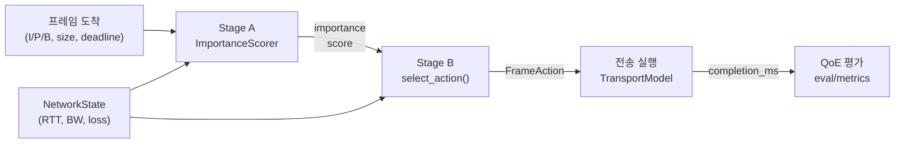

# 2026-03-29~30 — 프레임 중요도 기반 적응 전송 구조 리팩터링

## 목적

프레임 중요도 기반 적응 전송이라는 연구 목표에 맞게, 초기 TCP baseline 코드를 **프레임 단위 중요도 판단 + 전송 행동 결정** 구조로 재설계했다.
참조 논문의 "콘텐츠 중요도 기반 적응" 방향과 일치시키면서, 중요도 판단 방법론(heuristic → ML → RL)을 확장 가능하도록 모듈화했다.

## Before → After 요약

| 항목 | Phase 1 (초기 baseline) | Phase 2 (프레임 중요도 기반) |
|------|-------------------------|------------------------------|
| 의사결정 단위 | batch (배치) | frame (프레임) — H.264 I/P/B 중요도 기반 |
| action space | `(batch_bytes, flush_interval_ms)` 튜플 | `FrameAction` enum: RELIABLE_SINGLE, RELIABLE_MULTI, UNRELIABLE, DUPLICATE, DROP |
| 중요도 판단 | 고정 `importance_rank` (I=0, P=1, B=2) | `HeuristicImportanceScorer`: type + deadline slack + GOP 위치 → 동적 연속값 (v1, 향후 ML/RL 확장) |
| 전송 모델 | TCP 전용 근사 수식 | `TransportModel` ABC → `TCPTransportModel` + `QUICTransportModel` |
| 평가 지표 | latency/throughput 5개 + video utility 5개 | 기존 10개 + `rebuffer_ratio`, `ssim_proxy`, `block_completion_ratio` |
| RL 환경 | 독립 물리 모델, 8차원 state | `core.simulator` 통합, 12차원 state, `FrameAction` action |
| 코드 구조 | `tcp_batching_core.py` 684줄 단일 파일 | `core/`, `policy/`, `eval/` 패키지 분리 |

## 생성/변경된 파일

### core/ (시뮬레이션 엔진)

| 파일 | 역할 |
|------|------|
| `core/constants.py` | `DEFAULT_SEED`, `FIXED_BATCH_GRID`, `OBJECTIVE_WEIGHTS`, `snap()`, `safe_quantile()` |
| `core/workload.py` | `StaticFileConfig`, `VideoTraceConfig`, `generate_workload()`, `build_policy_features()` |
| `core/transport.py` | `TransportConfig`, `PathState`, `TCPTransportModel`, `QUICTransportModel` |
| `core/simulator.py` | `run_simulation()`, `evaluate_fixed_policy_grid()` |

### policy/ (전송 정책)

| 파일 | 역할 |
|------|------|
| `policy/importance.py` | `NetworkState`, `ImportanceScorer`(ABC), `HeuristicImportanceScorer` |
| `policy/action.py` | `FrameAction`(Enum), `select_action()` |
| `policy/legacy.py` | `PolicyConfig`, `resolve_policy()` (하위 호환) |

### eval/ (QoE 평가)

| 파일 | 역할 |
|------|------|
| `eval/metrics.py` | 기존 5개 + 신규 3개 지표, `compute_all_video_metrics()` |
| `eval/scoring.py` | `score_policy_rows()`, `select_best_fixed_config()` |

### 기타

| 파일 | 변경 내용 |
|------|-----------|
| `tcp_batching_core.py` | 684줄 구현 → re-export shim (하위 호환 유지) |
| `rl/env.py` | `FrameSchedulingEnv` (12차원 state, `FrameAction`, `eval.metrics` 통합) |
| `requirements.txt` | 신규: `numpy>=1.24`, `pandas>=2.0`, `matplotlib>=3.7`, `seaborn>=0.13`, `scikit-learn>=1.3` |

## 2단 아키텍처 흐름

### Stage A — 프레임 중요도 스코어링

- 입력: frame type, payload size, deadline slack, GOP 위치, buffer 상태
- 출력: importance score (0.0 ~ 1.0)
- v1: `HeuristicImportanceScorer` = 0.45*type_score + 0.40*urgency + 0.15*keyframe_bonus

### Stage B — 전송 행동 매핑

| 조건 | 결정 |
|------|------|
| deadline 초과 + 낮은 중요도 | `DROP` |
| 높은 중요도 + 여유 + 멀티패스 | `DUPLICATE` |
| 높은 중요도 | `RELIABLE_SINGLE` or `RELIABLE_MULTI` |
| 낮은 중요도 + 충분한 slack | `UNRELIABLE` |
| 기본 | `RELIABLE_SINGLE` |

## 신규 QoE 지표

| 지표 | 정의 |
|------|------|
| `rebuffer_ratio` | 연속 2프레임 이상 late인 구간의 프레임 수 / 전체 프레임 수 |
| `ssim_proxy` | 0.6 * on_time_rate + 0.4 * keyframe_on_time_rate (0~1) |
| `block_completion_ratio` | 모든 프레임이 on-time인 GOP 수 / 전체 GOP 수 |

## Smoke Test 결과 (4건 모두 통과)

| 테스트 | 결과 |
|--------|------|
| shim 경유 `run_simulation` | `immediate` 정책 throughput 정상 |
| 직접 import + importance + action | I-frame importance=0.6, action=RELIABLE_MULTI |
| RL env `run_episode` | reward=5.625, 25 steps |
| `compute_all_video_metrics` | rebuffer=0.5, ssim_proxy=0.7, block_completion=0.0 |
