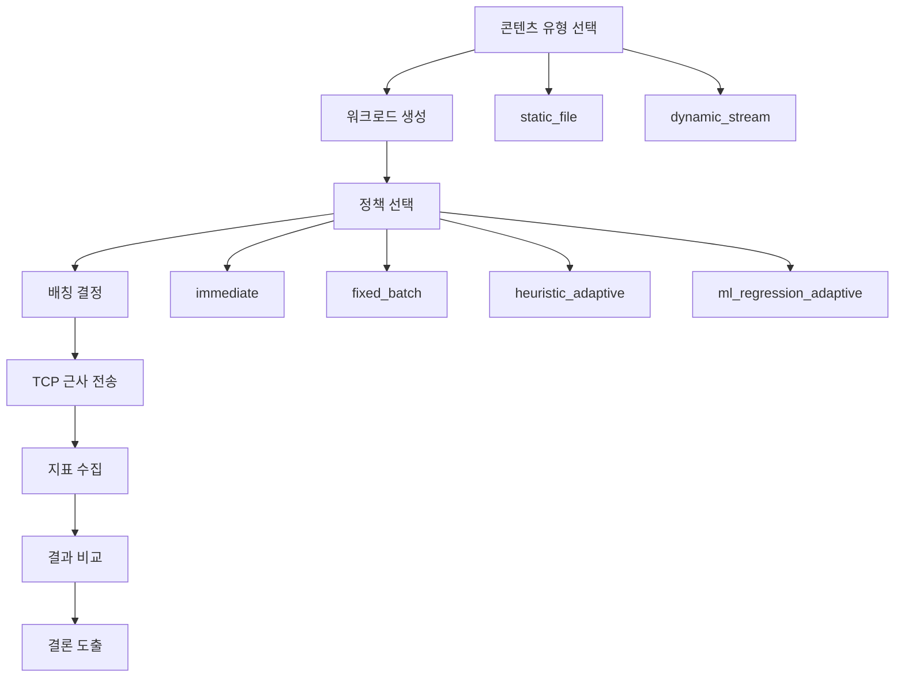

# TCP Content-Aware Adaptive Batching 실험 초기 계획

이 문서는 TCP 콘텐츠별 배칭 실험의 기준 문서다. 이후 노트북 구현과 실험 변경은 이 문서를 먼저 갱신한 뒤 진행한다. 목표 산출물은 [`C:\git\network\output\jupyter-notebook\tcp-content-aware-batching.ipynb`](C:\git\network\output\jupyter-notebook\tcp-content-aware-batching.ipynb)이며, 노트북의 섹션 순서와 함수 경계는 본 문서를 그대로 따른다.

## 1. 연구 목적과 배경

- TCP 환경에서는 작은 write가 반복되거나 콘텐츠가 빠르게 변할 때 batching 방식에 따라 latency와 throughput의 균형이 달라진다.
- 정적 파일 chunk 전송은 전송 효율과 goodput이 우선이며, 동적 streaming 전송은 freshness와 낮은 지연이 더 중요하다.
- 본 실험은 콘텐츠 특성에 따라 batching 정책을 다르게 적용했을 때 성능 차이가 어떻게 나타나는지 비교하는 것을 목표로 한다.
- 실험은 실제 커널 TCP 측정이 아니라 연구 발표용 비교 실험으로 설계하며, TCP 현상을 충분히 설명할 수 있는 혼합형 근사 시뮬레이터를 사용한다.

## 2. 실험 질문과 가설

### 실험 질문

- `RQ1`: `static_file`과 `dynamic_stream`은 동일한 batching 정책에서 서로 다른 최적 동작점을 보이는가.
- `RQ2`: `immediate`, `fixed_batch`, `heuristic_adaptive`, `ml_regression_adaptive` 사이에 latency-throughput trade-off 차이가 명확히 나타나는가.
- `RQ3`: 콘텐츠 유형과 도착 패턴을 반영한 적응형 정책이 단일 고정 정책보다 평균적으로 우수한가.
- `RQ4`: 학습 기반 정책이 휴리스틱 정책보다 oracle 설정에 더 가깝게 접근하는가.

### 가설

- `H1`: `static_file`에서는 큰 batch가 `immediate`보다 goodput과 throughput을 높인다.
- `H2`: `dynamic_stream`에서는 큰 고정 batch가 p95 latency와 staleness를 악화시킨다.
- `H3`: `heuristic_adaptive`는 두 콘텐츠 유형 모두에서 단일 `fixed_batch`보다 더 안정적인 성능을 보인다.
- `H4`: `ml_regression_adaptive`는 홀드아웃 시나리오에서 `heuristic_adaptive`보다 oracle score gap이 작거나 비슷하다.

## 3. 워크로드 정의

실험 워크로드는 `static_file`과 `dynamic_stream` 두 종류로 고정한다.

| Workload | 목적 | 핵심 입력 파라미터 | 생성 방식 | 기대 특성 |
| --- | --- | --- | --- | --- |
| `static_file` | 파일 chunk 전송 효율 비교 | `file_size_bytes`, `chunk_size_bytes`, `rtt_ms`, `bandwidth_mbps`, `delayed_ack_ms` | 고정 크기 파일을 순차 chunk로 나누어 연속 생성 | batch가 커질수록 flush 수가 줄고 goodput이 증가할 가능성이 높음 |
| `dynamic_stream` | 실시간성 있는 메시지 전송 비교 | `message_size_bytes`, `interarrival_ms`, `change_rate`, `rtt_ms`, `bandwidth_mbps`, `freshness_budget_ms` | 시간축을 따라 메시지가 지속적으로 생성되며 이전 상태가 빠르게 구식이 됨 | batch가 커질수록 latency와 staleness가 증가할 가능성이 높음 |

### `static_file` 기본값

| 파라미터 | 값 |
| --- | --- |
| `file_size_bytes` | `16 MiB` |
| `chunk_size_bytes` | `[512, 4096, 16384]` |
| `rtt_ms` | `[5, 30]` |
| `bandwidth_mbps` | `[20, 100]` |
| `delayed_ack_ms` | `[10, 40]` |
| `change_rate` | `0` |
| `freshness_budget_ms` | 사용하지 않음 |

### `dynamic_stream` 기본값

| 파라미터 | 값 |
| --- | --- |
| `message_size_bytes` | `[128, 512, 1200]` |
| `interarrival_ms` | `[10, 33, 100]` |
| `change_rate` | `['low', 'high']` |
| `rtt_ms` | `[10, 50]` |
| `bandwidth_mbps` | `[5, 20]` |
| `delayed_ack_ms` | `[10, 40]` |
| `freshness_budget_ms` | `[25, 75]` |

### 데이터 생성 규칙

- 모든 시나리오는 고정된 random seed를 사용해 재현 가능하게 생성한다.
- `change_rate='low'`는 최신 메시지가 오래 유효한 경우, `change_rate='high'`는 짧은 시간 안에 의미가 바뀌는 경우로 정의한다.
- `dynamic_stream`에서는 메시지가 flush 대기 중일 때 freshness budget을 넘기면 staleness penalty를 누적한다.

## 4. 정책 정의

비교 정책은 네 가지로 고정한다.

| Policy | 필수 입력값 | 의사결정 기준 | 기대 역할 |
| --- | --- | --- | --- |
| `immediate` | 없음 | 메시지 생성 즉시 flush | 최소 추가 대기, 높은 flush 빈도 |
| `fixed_batch` | `batch_bytes`, `flush_interval_ms` | 누적 바이트 또는 타이머 임계 도달 시 flush | 단순 baseline, static workload에 유리할 수 있음 |
| `heuristic_adaptive` | `content_type`, `change_rate`, `rtt_ms`, `freshness_budget_ms` | 콘텐츠 특성에 따라 batch 크기와 flush 상한을 규칙으로 변경 | 콘텐츠 인지형 규칙 기반 적응 |
| `ml_regression_adaptive` | 학습된 회귀 모델, 시나리오 feature | feature 기반으로 `batch_bytes`, `flush_interval_ms`를 예측 | oracle 근사, 정책 일반화 가능성 확인 |

### 정책별 상세 규칙

#### `immediate`

- 각 메시지 또는 chunk를 생성 직후 flush한다.
- 비교 기준선으로 사용하며 batching으로 인한 추가 지연이 없어야 한다.

#### `fixed_batch`

- sweep 범위를 고정한다.
- `batch_bytes = [512, 2048, 8192, 32768, 65536]`
- `flush_interval_ms = [0, 2, 5, 10, 20, 50]`
- `batch_bytes` 또는 `flush_interval_ms` 중 먼저 만족하는 조건으로 flush한다.

#### `heuristic_adaptive`

- `static_file`일 때는 throughput 중심으로 동작한다.
- 초기 batch 목표를 `max(4 * MSS, 0.5 * bandwidth_delay_product)`로 두고, flush 상한은 `min(0.5 * RTT, delayed_ack_ms)`로 제한한다.
- `dynamic_stream`일 때는 latency 중심으로 동작한다.
- batch 목표를 `min(2 * MSS, message_size_bytes * 4)`로 두고, flush 상한은 `min(freshness_budget_ms * 0.5, interarrival_ms * 1.5)`로 제한한다.
- `change_rate='high'`이면 batch 목표를 50% 줄이고 flush 상한도 50% 줄인다.

#### `ml_regression_adaptive`

- `fixed_batch` sweep 결과에서 각 시나리오별 oracle `batch_bytes`와 `flush_interval_ms`를 라벨로 만든다.
- 입력 feature는 아래로 고정한다.
  - `content_type`
  - `message_bytes_mean`
  - `interarrival_ms_mean`
  - `change_rate`
  - `rtt_ms`
  - `bandwidth_mbps`
  - `delayed_ack_ms`
  - `nagle_penalty_factor`
- 모델은 `RandomForestRegressor` 두 개로 고정한다.
  - 모델 1: 최적 `batch_bytes` 예측
  - 모델 2: 최적 `flush_interval_ms` 예측
- 학습 데이터는 synthetic sweep으로 생성하고, 홀드아웃 시나리오에서 oracle 대비 성능 저하를 평가한다.

## 5. 시뮬레이터 모델

시뮬레이터는 혼합형 TCP 근사 모델을 사용한다. 핵심 흐름은 `message generation -> batching decision -> TCP approximation -> metrics aggregation`이다.

### 모델 구성

1. `message generation`
   - 워크로드 설정에 따라 메시지 또는 chunk 이벤트를 시간축에 배치한다.
   - `static_file`은 포화 상태의 순차 전송, `dynamic_stream`은 간격 기반 도착 모델을 사용한다.
2. `batching decision`
   - 선택된 정책이 현재 큐 길이, 누적 바이트, flush 타이머, 콘텐츠 특성을 보고 flush 여부를 결정한다.
3. `TCP approximation`
   - `MSS=1460B` 기준으로 세그먼트 수를 계산한다.
   - 전송 시간은 `payload_bytes / link_rate`로 계산한다.
   - 작은 batch가 `MSS`보다 작을 때 Nagle 유사 hold penalty를 추가한다.
   - delayed ACK 유사 penalty는 `delayed_ack_ms`와 `nagle_penalty_factor * RTT` 중 작은 값으로 제한한다.
   - end-to-end completion time은 `queue_wait + tx_time + propagation_time + ack_penalty`의 합으로 근사한다.
4. `metrics aggregation`
   - 각 메시지의 latency, batch size, flush 횟수, 총 전송량, staleness를 누적하여 결과 테이블로 만든다.

### 공통 설정값

| 항목 | 기본값 |
| --- | --- |
| `MSS` | `1460 bytes` |
| `nagle_penalty_factor` | `0.25` |
| `propagation_component` | `RTT / 2` |
| `seed` | `20260309` |

### 노트북 함수 경계

- `generate_workload(config)` : 메시지 이벤트 생성
- `run_simulation(workload, tcp_cfg, policy_cfg)` : 정책 적용 및 TCP 근사 전송
- `summarize_results(results_df)` : 지표 집계와 비교 테이블 생성
- `plot_experiments(results_df)` : 비교 그래프 생성

## 6. 평가 지표

지표는 다음으로 고정한다.

| 지표 | 설명 | 주 사용 워크로드 |
| --- | --- | --- |
| `latency_mean_ms` | 평균 전송 완료 지연 | 공통 |
| `latency_p95_ms` | 상위 95% 지연 | 공통 |
| `throughput_mbps` | 전체 전송 처리량 | `static_file` 중심 |
| `goodput_bytes` | 유효하게 전달된 총 payload 양 | `static_file` 중심 |
| `flush_count` | flush 호출 횟수 | 공통 |
| `mean_batch_size_bytes` | 평균 batch 크기 | 공통 |
| `staleness_penalty` | freshness budget 초과 누적량 | `dynamic_stream` 중심 |
| `oracle_score_gap` | oracle 설정 대비 성능 차이 | 적응형 정책 평가 |

### 목적 함수

- `static_file`의 oracle 목적함수는 `goodput_bytes` 최대화 후 `latency_mean_ms` 최소화다.
- `dynamic_stream`의 oracle 목적함수는 `latency_p95_ms` 최소화 후 `goodput_bytes` 최대화다.
- 적응형 정책 평가는 각 워크로드 목적함수 기준으로 oracle과의 차이를 계산한다.

## 7. 실험 시나리오 매트릭스

### `static_file`

| 축 | 값 |
| --- | --- |
| `chunk_size_bytes` | `[512, 4096, 16384]` |
| `rtt_ms` | `[5, 30]` |
| `bandwidth_mbps` | `[20, 100]` |
| `delayed_ack_ms` | `[10, 40]` |
| `policy` | `immediate`, `fixed_batch`, `heuristic_adaptive`, `ml_regression_adaptive` |

### `dynamic_stream`

| 축 | 값 |
| --- | --- |
| `message_size_bytes` | `[128, 512, 1200]` |
| `interarrival_ms` | `[10, 33, 100]` |
| `change_rate` | `low`, `high` |
| `rtt_ms` | `[10, 50]` |
| `bandwidth_mbps` | `[5, 20]` |
| `freshness_budget_ms` | `[25, 75]` |
| `policy` | `immediate`, `fixed_batch`, `heuristic_adaptive`, `ml_regression_adaptive` |

### 결과물로 생성할 대표 그래프

- 콘텐츠별 정책 비교 bar chart
- latency-throughput Pareto scatter
- `fixed_batch` 성능 heatmap
- `ml_regression_adaptive` 예측값 vs oracle scatter
- 발표용 요약 표와 핵심 그림 PNG export

## 8. 기대 결과와 해석 기준

- `static_file`에서 `fixed_batch`와 적응형 계열은 `immediate`보다 높은 `throughput_mbps`와 `goodput_bytes`를 보여야 한다.
- `dynamic_stream`에서 큰 `fixed_batch`는 `latency_p95_ms`와 `staleness_penalty`를 증가시키는 방향이어야 한다.
- `heuristic_adaptive`는 두 워크로드 모두에서 극단적인 단일 설정보다 안정적인 성능을 보여야 한다.
- `ml_regression_adaptive`는 홀드아웃 시나리오 기준으로 `heuristic_adaptive`보다 작은 `oracle_score_gap`을 보이면 성공으로 간주한다.
- 위 경향이 재현되지 않으면 TCP 근사식, 목적함수, feature 설계를 우선 재검토한다.

## 9. 노트북 구현 계획

목표 노트북 경로는 [`C:\git\network\output\jupyter-notebook\tcp-content-aware-batching.ipynb`](C:\git\network\output\jupyter-notebook\tcp-content-aware-batching.ipynb)로 고정한다.

| 노트북 섹션 | 내용 | 주요 함수/산출물 |
| --- | --- | --- |
| 1. 실험 개요 | 연구 배경, 질문, 가설 요약 | Markdown |
| 2. 환경 및 재현성 | seed, 패키지 확인, 공통 설정 | config cell |
| 3. 워크로드 생성 | `static_file`, `dynamic_stream` 이벤트 생성 | `generate_workload` |
| 4. 정책 정의 | 네 정책 파라미터와 규칙 구현 | policy config cell |
| 5. TCP 근사 시뮬레이터 | batching과 전송 완료 시간 계산 | `run_simulation` |
| 6. baseline sweep | `immediate`, `fixed_batch` 비교 | results table |
| 7. adaptive 비교 | `heuristic_adaptive`, `ml_regression_adaptive` 포함 비교 | summary plots |
| 8. 학습 기반 실험 | oracle label 생성, 회귀 학습, 홀드아웃 평가 | model training cell |
| 9. 시각화 및 해석 | 그래프, 표, 결론 | `summarize_results`, `plot_experiments` |
| 10. 발표용 export | 핵심 그래프 PNG 저장 | `output/jupyter-notebook/assets/` |

### 구현 원칙

- 노트북은 clean kernel에서 위에서 아래로 한 번에 실행 가능해야 한다.
- 모든 파라미터는 상단 설정 셀에서 한 번에 수정 가능해야 한다.
- 그래프와 표는 발표 자료에 바로 옮길 수 있도록 제목, 축, 범례를 명확히 표기한다.
- Python 환경에는 `jupyterlab`, `ipykernel`, `numpy`, `pandas`, `matplotlib`, `seaborn`, `scikit-learn`을 사용한다.

## 10. Mermaid 흐름도

### Mermaid 노드와 노트북 매핑

| Mermaid 노드 | 의미 | 노트북 섹션 또는 함수 |
| --- | --- | --- |
| `콘텐츠 유형 선택` | `static_file` 또는 `dynamic_stream` 선택 | 노트북 섹션 3, `generate_workload` |
| `워크로드 생성` | 시간축 기반 메시지 또는 chunk 이벤트 생성 | 노트북 섹션 3, `generate_workload` |
| `정책 선택` | 비교할 batching 정책 결정 | 노트북 섹션 4 |
| `배칭 결정` | 누적 바이트와 flush 타이머에 따라 flush 여부 판단 | 노트북 섹션 5, `run_simulation` |
| `TCP 근사 전송` | MSS, RTT, link rate, ACK penalty를 반영해 완료 시간 계산 | 노트북 섹션 5, `run_simulation` |
| `지표 수집` | latency, throughput, goodput, staleness 집계 | 노트북 섹션 6~8, `summarize_results` |
| `결과 비교` | 정책 간 성능 비교와 시각화 | 노트북 섹션 7~9, `plot_experiments` |
| `결론 도출` | 연구 질문과 가설 기준으로 결과 해석 | 노트북 섹션 9 |

## 향후 변경 규칙

- 실험 축이 바뀌면 반드시 `3. 워크로드 정의`, `4. 정책 정의`, `7. 실험 시나리오 매트릭스`, `10. Mermaid 흐름도`를 함께 수정한다.
- 정책이 추가되거나 제거되면 본문 표, Mermaid 정책 노드, 노트북 구현 계획의 adaptive 비교 섹션을 동시에 수정한다.
- 지표가 바뀌면 `6. 평가 지표`와 `8. 기대 결과와 해석 기준`을 함께 수정한다.
- 노트북 함수 경계가 바뀌면 `5. 시뮬레이터 모델`과 Mermaid 매핑 표를 함께 수정한다.

## 변경 체크리스트

- [ ] 워크로드 수와 이름이 본문, Mermaid, 노트북 계획에서 일치하는가
- [ ] 정책 수와 이름이 본문, Mermaid, 노트북 계획에서 일치하는가
- [ ] 지표 이름이 평가 지표 표와 결과 해석 기준에서 일치하는가
- [ ] 시나리오 매트릭스가 워크로드 기본값과 충돌하지 않는가
- [ ] Mermaid 노드가 실제 노트북 섹션 또는 함수에 모두 매핑되는가
