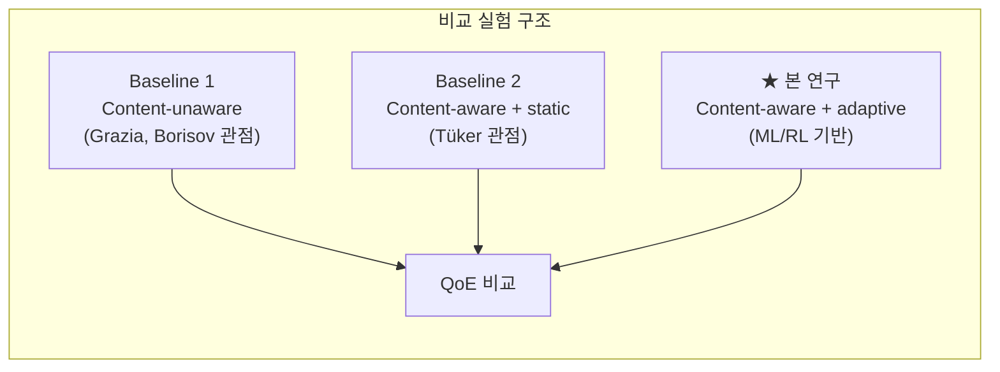

# 연관논문 3편 기반 프로젝트 방향 수정 조언

> 작성일: 2026-03-31  
> 대상: `c:\git\network` 프로젝트  
> 입력: 연관논문 3편 + 현재 코드 구현 상태 + `research_goal.md`

---

## 1. 핵심 진단: 현재 연구 정체성과 연관논문 간의 긴장

### 현재 선언된 정체성

> "본 연구는 TCP batching 연구가 **아니다**"  
> — AGENTS.md, research_goal.md, initial_plan.md 일관

### 연관논문 3편의 구조

| 논문 | 핵심 키워드 | 연구 레이어 |
|---|---|---|
| Tüker et al., 2024 | packet trimming, edge, H.264 SVC, content-aware | **응용 계층** (콘텐츠 중요도) |
| Grazia et al., 2021 | TCP Pacing, TCP Small Queues, latency | **전송 계층** (TCP 메커니즘) |
| Borisov et al., 2025 | adaptive batching, end-to-end estimation, Nagle | **전송 계층** (TCP 배칭) |

> [!IMPORTANT]
> 3편 중 2편(Grazia, Borisov)이 **TCP 전송 계층 메커니즘**을 다루고 있다. 이것은 현재 "TCP batching 연구가 아니다"라는 선언과 **표면적으로 충돌**한다. 이 긴장을 해소하는 것이 방향 수정의 핵심이다.

---

## 2. 결론: "연구 정체성"을 폐기가 아닌 **재정의**할 것

### ❌ 하지 말아야 할 것

- "TCP batching 연구입니다"로 회귀 → 기여 포인트가 불명확해짐
- Grazia/Borisov 논문을 무시 → 교수님이 지정한 연관논문 3편 구조를 거스름

### ✅ 해야 할 것: 3계층 통합 서사 구축

```
                         본 연구의 위치
                              │
    ┌─────────────────────────┼─────────────────────────┐
    │                         │                         │
    ▼                         ▼                         ▼
응용 계층              전송-응용 교차점              전송 계층
(콘텐츠 중요도)       (★ 핵심 기여 ★)           (TCP/QUIC 메커니즘)
                                                        
Tüker 2024            본 연구                   Grazia 2021
Content-aware         "콘텐츠 중요도를 전송 계층  TCP Pacing/TSQ
packet trimming       결정에 반영하는 교차점을
                      ML/RL로 학습"              Borisov 2025
                                                 E2E adaptive batching
```

**핵심 메시지**: 기존 연구들은 콘텐츠 중요도(Tüker)와 전송 메커니즘(Grazia, Borisov)을 **각각 별도로** 다뤘지만, **두 계층을 동시에 고려하여 프레임 단위로 전송 행동을 결정하는 연구는 부족하다**. 본 연구는 이 교차점을 메운다.

---

## 3. 구체적 방향 수정 항목

### 3.1 research_goal.md 재정의 — 연관논문과의 관계를 명시

현재 `research_goal.md`는 Simsek(=Tüker) 논문만 참조하지만, **Grazia와 Borisov도 정식으로 위치시켜야** 한다.

**권장 서사 구조:**

> 1. Grazia et al.(2021)이 TCP Pacing/TSQ를 통해 **전송 계층의 latency 문제**를 분석했고,
> 2. Borisov et al.(2025)이 **end-to-end 성능 추정 기반 적응형 배칭**으로 이를 개선하는 방법을 제시했으나,
> 3. 두 연구 모두 **전송하는 데이터의 콘텐츠 특성(중요도)**을 고려하지 않는다.
> 4. 반면 Tüker et al.(2024)은 **콘텐츠 중요도 기반 packet trimming**을 제안했으나, 전송 계층 결정(배칭/패이싱)과의 관계는 다루지 않는다.
> 5. **본 연구는 이 두 축(콘텐츠 중요도 + 전송 계층 결정)을 통합**하여, 프레임 단위 중요도 스코어가 전송 행동(배칭 크기, flush 시점, 신뢰/비신뢰 모드)을 직접 결정하는 시스템을 제안한다.

### 3.2 TCP 배칭을 "비교 대상/동기부여"로 **재해석**

| 현재 코드 요소 | 기존 해석 | **수정된 해석** |
|---|---|---|
| `policy/legacy.py` 6종 정책 | "하위 호환 레이어" | **Grazia+Borisov 관점의 baseline**: TCP 전송 계층만으로 결정하는 정책 |
| `fixed_hybrid`, `fixed_size`, `fixed_time` | 단순 grid search용 | **Borisov (2025)의 "static batching"에 대응**: 콘텐츠 무관 고정 배칭의 한계를 보여주는 대조군 |
| `heuristic_frame_aware` | 중간 단계 | **Grazia+Tüker 통합 시도 v0**: TCP 메커니즘(flush timing)을 프레임 특성(keyframe, slack)으로 조절하는 첫 시도 |
| `frame_action_adaptive` | 핵심 정책 | **본 연구의 핵심**: 중요도 스코어 → 전송 행동을 학습 가능하게 만듦 |

### 3.3 실험 설계에서 논문 3편을 비교 축으로 활용



| 비교군 | 대응 논문 | 코드 매핑 | 의미 |
|---|---|---|---|
| **Baseline 1**: Content-unaware 배칭 | Borisov 2025 | `fixed_hybrid` (고정 batch/flush) | 콘텐츠를 모르는 상태에서 E2E 성능만 보고 배칭 결정 |
| **Baseline 2**: Content-aware + 고정 규칙 | Tüker 2024 | `heuristic_frame_aware` | IPB 타입으로 우선순위는 부여하지만, 학습 기반이 아님 |
| **★ 제안**: Content-aware + adaptive | 본 연구 기여 | `frame_action_adaptive` / `frame_action_ml_adaptive` | ML/RL 기반 동적 중요도 판단 → 전송 행동 결정 |

### 3.4 코드에 추가/수정해야 할 사항

#### A. Borisov 스타일 "E2E 성능 추정" 요소 반영 (우선도: 중)

Borisov(2025)의 핵심은 **end-to-end latency/throughput을 추정하여 batching을 동적 조절**하는 것이다. 현재 코드의 `TransportConfig`는 RTT/bandwidth가 고정값인데, 이를 **시뮬레이션 중 동적으로 변화하는 PathState**로 확장하면 Borisov의 관점을 흡수할 수 있다.

```python
# 현재: 고정값
network = NetworkState(rtt_ms=30.0, bandwidth_mbps=8.0)

# 수정 권장: 시뮬 진행 중 변화하는 추정값
network = NetworkState(
    rtt_ms=estimated_rtt_ms,           # 최근 전송 기록 기반 추정
    bandwidth_mbps=estimated_bw_mbps,  # sliding window 평균
    loss_rate=recent_loss_rate,
    buffer_level_ms=current_buffer,
)
```

이렇게 하면 **"Borisov의 E2E 추정 + Tüker의 콘텐츠 중요도 = 본 연구의 ML/RL 입력"**이라는 서사가 완성된다.

#### B. Grazia 스타일 "TCP queue 제어" 반영 (우선도: 낮)

Grazia(2021)의 TSQ/Pacing은 **커널 레벨 TCP 동작**이므로 시뮬레이터에서 직접 구현할 필요는 없다. 대신:

1. `core/simulator.py`의 `flush()` 함수에서 **TSQ 영향을 근사하는 파라미터**를 추가
2. 실험 보고서에서 "Grazia et al.이 분석한 TSQ/Pacing 효과는 본 연구의 시뮬레이터에서 `ack_penalty_ms`와 `nagle_penalty_factor`로 근사됨"이라고 명시

#### C. `select_action()`의 입력 확장 (우선도: 높)

현재 `select_action(importance_score, deadline_slack_ms, network, available_paths)`에 **Borisov 관점의 "현재 큐 상태/배칭 효과 추정"**을 추가:

```python
def select_action(
    importance_score: float,
    deadline_slack_ms: float,
    network: NetworkState,
    available_paths: int = 1,
    queue_bytes: int = 0,           # 현재 배칭 큐 크기 (Borisov 관점)
    estimated_batch_gain: float = 0.0,  # 배칭으로 인한 예상 throughput 향상
) -> FrameAction:
```

이렇게 하면 **"E2E 성능 추정(Borisov)이 콘텐츠 중요도(Tüker)와 함께 전송 행동 결정에 반영된다"**는 논문 서사가 코드에 직접 대응된다.

---

## 4. 논문 작성 시 권장 관련연구(Related Work) 구조

```
2. Related Work
  2.1 콘텐츠 중요도 기반 적응 전송
      - Tüker et al. (2024): packet trimming, H.264 SVC, edge → 콘텐츠 중요도 활용의 선행
      - 한계: 전송 계층(TCP/QUIC) 결정과의 결합 부재
      
  2.2 TCP 전송 계층 최적화
      - Grazia et al. (2021): TSQ/Pacing의 latency 효과 분석 → TCP 내부 메커니즘의 한계/가능성
      - Borisov et al. (2025): E2E 성능 추정 기반 적응형 배칭 → static batching의 한계 제시
      - 한계: 전송할 데이터의 콘텐츠 특성을 고려하지 않음
      
  2.3 멀티패스/부분 신뢰성 전송
      - MPTCP (RFC 8684), MPQUIC (I-D), QUIC DATAGRAM (RFC 9221)
      - MPR-QUIC (Han et al.): 프레임 우선순위 + deadline 기반 스케줄러
      
  2.4 연구 공백 (Research Gap)
      ★ "콘텐츠 중요도를 전송 계층 결정(배칭/패이싱/경로 선택)에
         ML/RL로 학습하여 반영하는 end-to-end 시스템"은 부재
```

---

## 5. 발표용 한 줄 정리 (수정 제안)

### 현재 발표용 문구 (research_goal.md L83-84)
> 본 연구는 비디오 프레임의 H.264 코덱 중요도를 동적으로 판단하여 프레임 단위 전송 행동을 결정하는 적응 전송 시스템을 제안한다.

### 수정 권장 문구
> 기존 연구는 TCP 전송 계층 최적화(Grazia 2021, Borisov 2025)와 콘텐츠 중요도 기반 적응 전송(Tüker 2024)을 **개별적으로** 다뤄왔으나, 두 축을 **동시에 학습 가능한 형태로 통합**한 연구는 부족하다. 본 연구는 H.264 프레임 중요도를 ML/RL로 동적 판단하고, 이를 전송 행동(배칭 크기, flush 시점, 신뢰/비신뢰 모드)에 직접 반영하는 **cross-layer 적응 전송 시스템**을 제안한다.

---

## 6. 우선순위 실행 계획

| 순서 | 작업 | 목적 | 관련 논문 | 난이도 |
|---|---|---|---|---|
| 1 | `research_goal.md` 갱신: 3편 연관논문 위치 명시 | 연구 서사 정립 | 전체 | 낮음 |
| 2 | 실험에서 Baseline 1/2/제안 3그룹 비교 구조 설정 | 비교 실험 틀 확보 | Borisov, Tüker | 낮음 |
| 3 | `NetworkState`에 동적 추정값 반영 (estimated RTT/bw) | Borisov 관점 흡수 | Borisov 2025 | 중간 |
| 4 | `select_action()` 입력에 queue/batch 상태 추가 | cross-layer 입력 완성 | Borisov + Tüker | 중간 |
| 5 | ML scorer에 네트워크 상태 피처 가중치 분석 (feature importance) | 어블레이션 + 논문 근거 | 전체 | 중간 |
| 6 | 다양한 네트워크 조건(RTT/loss/bw 조합)에서 3그룹 비교 | 핵심 실험 결과 | Grazia + Borisov | 높음 |

---

## 7. AGENTS.md "연구 정체성" 수정 권고

현재:
> "본 연구는 TCP batching 연구가 아니다."

수정 제안:
> "본 연구는 단순 TCP batching 최적화가 아니다. TCP/QUIC 전송 계층 결정(Grazia 2021, Borisov 2025)에 **콘텐츠 중요도**(Tüker 2024)를 ML/RL 기반으로 통합하는 **cross-layer 적응 전송 연구**다."

이렇게 하면 3편 연관논문과의 관계가 일관되면서도, "단순 batching이 아니다"라는 차별화 메시지를 유지할 수 있다.

---

## 참고 논문

1. **Tüker et al., 2024** — "Using Packet Trimming at the Edge for In-Network Video Quality Adaption". H.264 SVC 기반 packet trimming으로 콘텐츠 중요도를 활용한 edge 적응 전송.
2. **Grazia et al., 2021** — "The New TCP Modules on the Block: TCP Pacing & TCP Small Queues", IEEE Access, Vol.9. 송신측 TCP 큐 및 패이싱 제어가 latency에 미치는 영향 분석.
3. **Borisov, Amit, Tsafrir, 2025** — "Batching with End-to-End Performance Estimation", HotOS '25. Little's Law 기반 E2E 성능 추정으로 Nagle 알고리즘 동적 토글, Redis에서 throughput 2x/latency 3x 개선 보고.
4. **Simsek et al., 2023** — "Using packet trimming at the edge for in-network video quality adaption". 본 프로젝트의 기존 주요 참조 논문(= Tüker 2024의 초기 버전으로 추정).
